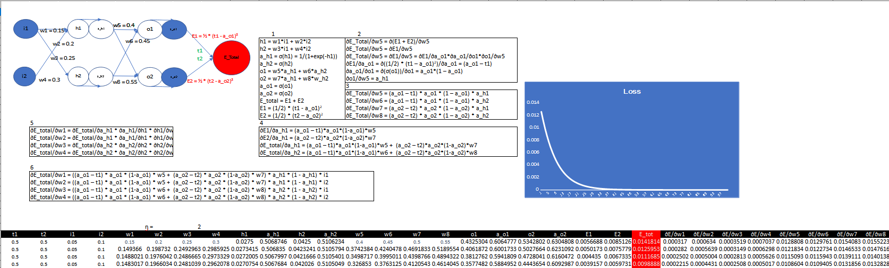
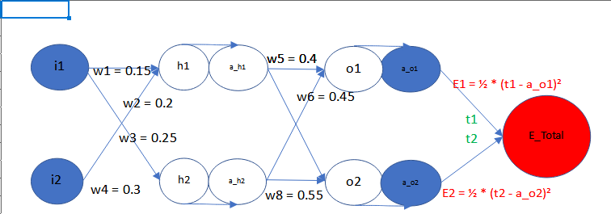
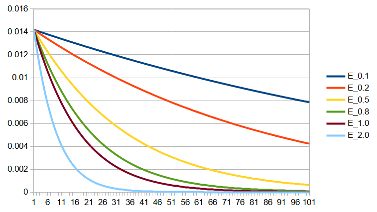

# Session 6 - Backpropagatino and Advanced Architecture
A step by step guide to backpropagation and brief introduction to architectures like VGG and ResNet. 

## Part 1 Backpropagation
### Screenshot of excel sheel

### Steps for backpropagation
Let's consider network shown in image below. 

#### Step 1: Forward pass
First we pass input values through neural network and get predition. Then we calculate loss between 
actual values and predicted values. 
##### Equations for Forwatd pass
h1 = w1\*i1 + w2\*i2  
h2 = w3\*i1 + w4\*i2  
a_h1 = σ(h1) = 1/(1+exp(-h1))  
a_h2 = σ(h2)  
o1 = w5\*a_h1 + w6\*a_h2  
o2 = w7\*a_h1 + w8\*w_h2  
a_o1 = σ(o1)  
a_o2 = σ(o2)  
E_total = E1 + E2  
E1 = (1/2) \* (t1 - a_o1)2  
E2 = (1/2) \* (t2 – a_o2)2  

#### Step 2: Backpropagate loss to hidden layer
For backpropagation, we will calculate partial derivative of total loss with respect to a weight in
hidden layer.
##### Partial derivative of total loss with respect to w5
∂E_Total/∂w5 = ∂(E1 + E2)/∂w5  
∂E_Total/∂w5 = ∂E1/∂w5  
∂E_Total/∂w5 = ∂E1/∂w5 = ∂E1/∂a_o1\*∂a_o1/∂o1\*∂o1/∂w5  
∂E1/∂a_o1 = ∂((1/2) \* (t1 – a_o1)2)/∂a_o1 = (a_o1 – t1)  
∂a_o1/∂o1 = ∂(σ(o1))/∂o1 = a_o1\*(1 – a_o1)  
∂o1/∂w5 = a_h1  
∂E_Total/∂w5 = (a_o1 – t1) \* a_o1 \* (1 – a_o1) \* a_h1  

#### Step 3: Write partial derivative for weights of hidden layer
Based on formula derived in Step 2, we can write partial derivative of total loss with respect to 
each weights of hidden layer.
##### Partial derivative of total loss with respect to w5, w6, w7, w8
∂E_Total/∂w5 = (a_o1 – t1) \* a_o1 \* (1 – a_o1) \* a_h1  
∂E_Total/∂w6 = (a_o1 – t1) \* a_o1 \* (1 – a_o1) \* a_h2  
∂E_Total/∂w7 = (a_o2 – t2) \* a_o2 \* (1 – a_o2) \* a_h1  
∂E_Total/∂w8 = (a_o2 – t2) \* a_o2 \* (1 – a_o2) \* a_h2  

#### Step 4: Write partial derivative for activation in hidden layer
Now we have to calculate partial derivative of total loss with respect to activation in hidden
layer. This will be usefull while calculating partial derivative for weights of input layer.
##### Partial derivative of total loss with respect to a_h1, a_h2, 
∂E1/∂a_h1 = (a_o1 – t1)\*a_o1\*(1-a_o1)\*w5  
∂E2/∂a_h1 = (a_o2 – t2)\*a_o2\*(1-a_o2)\*w7  
∂E_total/∂a_h1 = (a_o1 – t1)\*a_o1\*(1-a_o1)\*w5 +  (a_o2 – t2)\*a_o2\*(1-a_o2)\*w7  
∂E_total/∂a_h2 = (a_o1 – t1)\*a_o1\*(1-a_o1)\*w6 +  (a_o2 – t2)\*a_o2\*(1-a_o2)\*w8  

#### Step 5: Write partial derivative for weights of input layer
Similar to hidden layer, we have to calculate partial derivative of total loss with respect to each
weights of input layer.
##### Partial derivative of total loss with respect to w1, w2, w3, w4
∂E_total/∂w1 = ∂E_total/∂a_h1 \* ∂a_h1/∂h1 \* ∂h1/∂w1  
∂E_total/∂w2 = ∂E_total/∂a_h1 \* ∂a_h1/∂h1 \* ∂h1/∂w2  
∂E_total/∂w3 = ∂E_total/∂a_h2 \* ∂a_h2/∂h2 \* ∂h2/∂w3  
∂E_total/∂w4 = ∂E_total/∂a_h2 \* ∂a_h2/∂h2 \* ∂h2/∂w4  

#### Step 6: Final equations for input layer
Replacing values in equations shown in Step 5.
##### Partial derivative of total loss with respect to w1, w2, w3, w4
∂E_total/∂w1 = ((a_o1 – t1) \* a_o1 \* (1-a_o1) \* w5 +  (a_o2 – t2) \* a_o2 \* (1-a_o2) \* w7) \* a_h1 \* (1 - a_h1) \* i1  
∂E_total/∂w2 = ((a_o1 – t1) \* a_o1 \* (1-a_o1) \* w5 +  (a_o2 – t2) \* a_o2 \* (1-a_o2) \* w7) \* a_h1 \* (1 - a_h1) \* i2  
∂E_total/∂w3 = ((a_o1 – t1) \* a_o1 \* (1-a_o1) \* w6 +  (a_o2 – t2) \* a_o2 \* (1-a_o2) \* w8) \* a_h2 \* (1 - a_h2) \* i1  
∂E_total/∂w4 = ((a_o1 – t1) \* a_o1 \* (1-a_o1) \* w6 +  (a_o2 – t2) \* a_o2 \* (1-a_o2) \* w8) \* a_h2 \* (1 - a_h2) \* i2  

#### Step 7: Update weights
Based on values of partial derivative we will update our weights  
new_w1 = w1 - ƞ \* ∂E_total/∂w1  
new_w2 = w2 - ƞ \* ∂E_total/∂w2  
new_w3 = w3 - ƞ \* ∂E_total/∂w3  
new_w4 = w4 - ƞ \* ∂E_total/∂w4  
new_w5 = w5 - ƞ \* ∂E_total/∂w5  
new_w6 = w6 - ƞ \* ∂E_total/∂w6  
new_w7 = w7 - ƞ \* ∂E_total/∂w7  
new_w8 = w8 - ƞ \* ∂E_total/∂w8  
where, ƞ is learning rate

#### Go to step 1

### Result of changing learning rate
Below plot shows loss of network with different learning rate [0.1, 0.2, 0.5, 0.8, 1.0, 2.0]

As we can see in plot, as we increase learning rate model converges faster. This might we true in
this paeticular case. In general very small or very large learnig rate can have negative impact on 
model training. 

## Part 2 Train neural network

1. Validation accuracy: 99.46%.
2. Total parameters: 12,442
3. Epoch: 19

### Architecture

    ----------------------------------------------------------------
            Layer (type)               Output Shape         Param #
    ================================================================
             Conv2d-1            [-1, 8, 28, 28]              80
        BatchNorm2d-2            [-1, 8, 28, 28]              16
            Dropout-3            [-1, 8, 28, 28]               0
             Conv2d-4            [-1, 8, 28, 28]             584
        BatchNorm2d-5            [-1, 8, 28, 28]              16
            Dropout-6            [-1, 8, 28, 28]               0
             Conv2d-7            [-1, 8, 28, 28]             584
        BatchNorm2d-8            [-1, 8, 28, 28]              16
          MaxPool2d-9            [-1, 8, 14, 14]               0
           Dropout-10            [-1, 8, 14, 14]               0
            Conv2d-11           [-1, 16, 14, 14]           1,168
       BatchNorm2d-12           [-1, 16, 14, 14]              32
           Dropout-13           [-1, 16, 14, 14]               0
            Conv2d-14           [-1, 16, 12, 12]           2,320
       BatchNorm2d-15           [-1, 16, 12, 12]              32
         MaxPool2d-16             [-1, 16, 6, 6]               0
           Dropout-17             [-1, 16, 6, 6]               0
            Conv2d-18             [-1, 32, 4, 4]           4,640
       BatchNorm2d-19             [-1, 32, 4, 4]              64
           Dropout-20             [-1, 32, 4, 4]               0
            Conv2d-21             [-1, 10, 2, 2]           2,890
    ================================================================
    Total params: 12,442
    Trainable params: 12,442
    Non-trainable params: 0
    ----------------------------------------------------------------
    Input size (MB): 0.00
    Forward/backward pass size (MB): 0.53
    Params size (MB): 0.05
    Estimated Total Size (MB): 0.58
    ----------------------------------------------------------------

### Training Stats

    epoch=1 loss=0.1532626897096634 batch_id=468: 100%|██████████| 469/469 [00:29<00:00, 15.66it/s]

    Test set: Average loss: 0.0724, Accuracy: 9769/10000 (97.69%)

    Adjusting learning rate of group 0 to 1.0000e-02.
    epoch=2 loss=0.05458409711718559 batch_id=468: 100%|██████████| 469/469 [00:25<00:00, 18.72it/s]

    Test set: Average loss: 0.0704, Accuracy: 9800/10000 (98.00%)

    Adjusting learning rate of group 0 to 1.0000e-02.
    epoch=3 loss=0.10047952085733414 batch_id=468: 100%|██████████| 469/469 [00:24<00:00, 18.83it/s]

    Test set: Average loss: 0.0396, Accuracy: 9880/10000 (98.80%)

    Adjusting learning rate of group 0 to 1.0000e-02.
    epoch=4 loss=0.02313343435525894 batch_id=468: 100%|██████████| 469/469 [00:25<00:00, 18.47it/s]

    Test set: Average loss: 0.0293, Accuracy: 9916/10000 (99.16%)

    Adjusting learning rate of group 0 to 1.0000e-02.
    epoch=5 loss=0.05266479775309563 batch_id=468: 100%|██████████| 469/469 [00:24<00:00, 19.10it/s]

    Test set: Average loss: 0.0305, Accuracy: 9904/10000 (99.04%)

    Adjusting learning rate of group 0 to 1.0000e-02.
    epoch=6 loss=0.047739122062921524 batch_id=468: 100%|██████████| 469/469 [00:24<00:00, 18.82it/s]

    Test set: Average loss: 0.0273, Accuracy: 9911/10000 (99.11%)

    Adjusting learning rate of group 0 to 1.0000e-02.
    epoch=7 loss=0.1300845891237259 batch_id=468: 100%|██████████| 469/469 [00:25<00:00, 18.71it/s]

    Test set: Average loss: 0.0234, Accuracy: 9929/10000 (99.29%)

    Adjusting learning rate of group 0 to 1.0000e-02.
    epoch=8 loss=0.01588621735572815 batch_id=468: 100%|██████████| 469/469 [00:25<00:00, 18.56it/s]

    Test set: Average loss: 0.0242, Accuracy: 9927/10000 (99.27%)

    Adjusting learning rate of group 0 to 1.0000e-02.
    epoch=9 loss=0.031009763479232788 batch_id=468: 100%|██████████| 469/469 [00:24<00:00, 19.10it/s]

    Test set: Average loss: 0.0246, Accuracy: 9929/10000 (99.29%)

    Adjusting learning rate of group 0 to 1.0000e-02.
    epoch=10 loss=0.01471023540943861 batch_id=468: 100%|██████████| 469/469 [00:24<00:00, 19.29it/s]

    Test set: Average loss: 0.0216, Accuracy: 9939/10000 (99.39%)

    Adjusting learning rate of group 0 to 1.0000e-03.
    epoch=11 loss=0.03565393015742302 batch_id=468: 100%|██████████| 469/469 [00:24<00:00, 19.18it/s]

    Test set: Average loss: 0.0201, Accuracy: 9941/10000 (99.41%)

    Adjusting learning rate of group 0 to 1.0000e-03.
    epoch=12 loss=0.009008736349642277 batch_id=468: 100%|██████████| 469/469 [00:24<00:00, 19.25it/s]

    Test set: Average loss: 0.0199, Accuracy: 9945/10000 (99.45%)

    Adjusting learning rate of group 0 to 1.0000e-03.
    epoch=13 loss=0.07570170611143112 batch_id=468: 100%|██████████| 469/469 [00:24<00:00, 19.28it/s]

    Test set: Average loss: 0.0194, Accuracy: 9946/10000 (99.46%)

    Adjusting learning rate of group 0 to 1.0000e-03.
    epoch=14 loss=0.0179744940251112 batch_id=468: 100%|██████████| 469/469 [00:24<00:00, 19.16it/s]

    Test set: Average loss: 0.0194, Accuracy: 9945/10000 (99.45%)

    Adjusting learning rate of group 0 to 1.0000e-03.
    epoch=15 loss=0.008225314319133759 batch_id=468: 100%|██████████| 469/469 [00:25<00:00, 18.68it/s]

    Test set: Average loss: 0.0193, Accuracy: 9946/10000 (99.46%)

    Adjusting learning rate of group 0 to 1.0000e-03.
    epoch=16 loss=0.015221248380839825 batch_id=468: 100%|██████████| 469/469 [00:25<00:00, 18.48it/s]

    Test set: Average loss: 0.0199, Accuracy: 9945/10000 (99.45%)

    Adjusting learning rate of group 0 to 1.0000e-03.
    epoch=17 loss=0.058552276343107224 batch_id=468: 100%|██████████| 469/469 [00:25<00:00, 18.25it/s]

    Test set: Average loss: 0.0193, Accuracy: 9943/10000 (99.43%)

    Adjusting learning rate of group 0 to 1.0000e-03.
    epoch=18 loss=0.06084350869059563 batch_id=468: 100%|██████████| 469/469 [00:25<00:00, 18.54it/s]

    Test set: Average loss: 0.0188, Accuracy: 9945/10000 (99.45%)

    Adjusting learning rate of group 0 to 1.0000e-03.
    epoch=19 loss=0.011919829063117504 batch_id=468: 100%|██████████| 469/469 [00:25<00:00, 18.31it/s]

    Test set: Average loss: 0.0193, Accuracy: 9946/10000 (99.46%)

    Adjusting learning rate of group 0 to 1.0000e-03.
