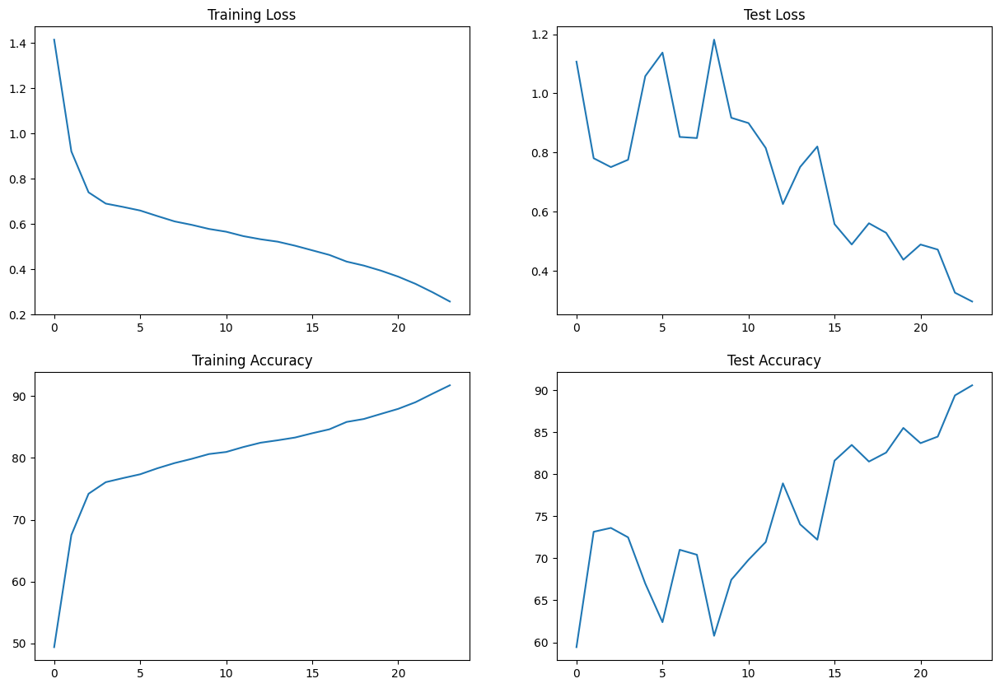

# Assignment
1. Write a custom ResNet architecture for CIFAR10 that has the following architecture:
    1. PrepLayer - Conv 3x3 (s1, p1) >> BN >> RELU [64k]
    2. Layer1 -
        1. X = Conv 3x3 (s1, p1) >> MaxPool2D >> BN >> RELU [128k]
        2. R1 = ResBlock( (Conv-BN-ReLU-Conv-BN-ReLU))(X) [128k] 
        3. Add(X, R1)
    3. Layer 2 -
        1. Conv 3x3 [256k]
        2. MaxPooling2D
        3. BN
        4. ReLU
    4. Layer 3 -
        1. X = Conv 3x3 (s1, p1) >> MaxPool2D >> BN >> RELU [512k]
        2. R2 = ResBlock( (Conv-BN-ReLU-Conv-BN-ReLU))(X) [512k]
        3. Add(X, R2)
    5. MaxPooling with Kernel Size 4
    6. FC Layer 
    7. SoftMax
2. Uses One Cycle Policy such that:
    1. Total Epochs = 24
    2. Max at Epoch = 5
    3. LRMIN = FIND
    4. LRMAX = FIND
    5. NO Annihilation
3. Uses this transform -RandomCrop 32, 32 (after padding of 4) >> FlipLR >> Followed by CutOut(8, 8)
4. Batch size = 512
5. Use ADAM and CrossEntropyLoss
6. Target Accuracy: 90%
7. NO score if your code is not modular. Your collab must be importing your GitHub package, and then just running the model. I should be able to find the custom_resnet.py model in your MASTER GitHub repo that you'd be training. 

# Introduction
The goal of this assignment is to implement ResNet model that was used by David Page in DawnBench competition. David page published an [article](https://myrtle.ai/learn/how-to-train-your-resnet-8-bag-of-tricks/) about his approach and explained some minor changes to improve train time on model. We are using a version of model from this article. 

Another important task is to use One Cycle Policy to reduce number of epochs required for training and learning rate finder to find maximum learning rate for one cycle policy. 

# Model architecture

# Output of image augmentation

# Model summary
    ----------------------------------------------------------------
            Layer (type)               Output Shape         Param #
    ================================================================
              Conv2d-1           [-1, 64, 32, 32]           1,728
          BatchNorm2d-2           [-1, 64, 32, 32]             128
                ReLU-3           [-1, 64, 32, 32]               0
              Conv2d-4          [-1, 128, 32, 32]          73,728
            MaxPool2d-5          [-1, 128, 16, 16]               0
          BatchNorm2d-6          [-1, 128, 16, 16]             256
                ReLU-7          [-1, 128, 16, 16]               0
              Conv2d-8          [-1, 128, 16, 16]         147,456
          BatchNorm2d-9          [-1, 128, 16, 16]             256
                ReLU-10          [-1, 128, 16, 16]               0
              Conv2d-11          [-1, 128, 16, 16]         147,456
        BatchNorm2d-12          [-1, 128, 16, 16]             256
                ReLU-13          [-1, 128, 16, 16]               0
            ResBlock-14          [-1, 128, 16, 16]               0
              Conv2d-15          [-1, 256, 16, 16]         294,912
          MaxPool2d-16            [-1, 256, 8, 8]               0
        BatchNorm2d-17            [-1, 256, 8, 8]             512
                ReLU-18            [-1, 256, 8, 8]               0
              Conv2d-19            [-1, 512, 8, 8]       1,179,648
          MaxPool2d-20            [-1, 512, 4, 4]               0
        BatchNorm2d-21            [-1, 512, 4, 4]           1,024
                ReLU-22            [-1, 512, 4, 4]               0
              Conv2d-23            [-1, 512, 4, 4]       2,359,296
        BatchNorm2d-24            [-1, 512, 4, 4]           1,024
                ReLU-25            [-1, 512, 4, 4]               0
              Conv2d-26            [-1, 512, 4, 4]       2,359,296
        BatchNorm2d-27            [-1, 512, 4, 4]           1,024
                ReLU-28            [-1, 512, 4, 4]               0
            ResBlock-29            [-1, 512, 4, 4]               0
          MaxPool2d-30            [-1, 512, 1, 1]               0
            Flatten-31                  [-1, 512]               0
              Linear-32                   [-1, 10]           5,130
    ================================================================
    Total params: 6,573,130
    Trainable params: 6,573,130
    Non-trainable params: 0
    ----------------------------------------------------------------
    Input size (MB): 0.01
    Forward/backward pass size (MB): 6.76
    Params size (MB): 25.07
    Estimated Total Size (MB): 31.84
    ----------------------------------------------------------------

# Learning rate finder

# Training log
    Epoch 1
    Current learning rate: [0.0001873817422860384]
    Train: Loss=1.0277 Batch_id=97 Accuracy=49.40: 100%|██████████| 98/98 [00:18<00:00,  5.26it/s]
    Test set: Average loss: 1.1073, Accuracy: 5943/10000 (59.43%)

    Epoch 2
    Current learning rate: [0.0005253586271455188]
    Train: Loss=0.7637 Batch_id=97 Accuracy=67.53: 100%|██████████| 98/98 [00:18<00:00,  5.20it/s]
    Test set: Average loss: 0.7805, Accuracy: 7315/10000 (73.15%)

    Epoch 3
    Current learning rate: [0.0008633355120049991]
    Train: Loss=0.8614 Batch_id=97 Accuracy=74.21: 100%|██████████| 98/98 [00:19<00:00,  5.00it/s]
    Test set: Average loss: 0.7506, Accuracy: 7361/10000 (73.61%)

    Epoch 4
    Current learning rate: [0.0012013123968644794]
    Train: Loss=0.7230 Batch_id=97 Accuracy=76.08: 100%|██████████| 98/98 [00:19<00:00,  5.10it/s]
    Test set: Average loss: 0.7754, Accuracy: 7249/10000 (72.49%)

    Epoch 5
    Current learning rate: [0.0015392892817239596]
    Train: Loss=0.7418 Batch_id=97 Accuracy=76.74: 100%|██████████| 98/98 [00:19<00:00,  5.02it/s]
    Test set: Average loss: 1.0583, Accuracy: 6699/10000 (66.99%)

    Epoch 6
    Current learning rate: [0.0018729117108944474]
    Train: Loss=0.6424 Batch_id=97 Accuracy=77.36: 100%|██████████| 98/98 [00:19<00:00,  4.90it/s]
    Test set: Average loss: 1.1379, Accuracy: 6240/10000 (62.40%)

    Epoch 7
    Current learning rate: [0.0017841519382326397]
    Train: Loss=0.5542 Batch_id=97 Accuracy=78.33: 100%|██████████| 98/98 [00:19<00:00,  5.00it/s]
    Test set: Average loss: 0.8525, Accuracy: 7101/10000 (71.01%)

    Epoch 8
    Current learning rate: [0.001695392165570832]
    Train: Loss=0.5671 Batch_id=97 Accuracy=79.17: 100%|██████████| 98/98 [00:19<00:00,  4.98it/s]
    Test set: Average loss: 0.8488, Accuracy: 7042/10000 (70.42%)

    Epoch 9
    Current learning rate: [0.0016066323929090243]
    Train: Loss=0.6623 Batch_id=97 Accuracy=79.86: 100%|██████████| 98/98 [00:20<00:00,  4.90it/s]
    Test set: Average loss: 1.1816, Accuracy: 6078/10000 (60.78%)

    Epoch 10
    Current learning rate: [0.0015178726202472166]
    Train: Loss=0.6138 Batch_id=97 Accuracy=80.63: 100%|██████████| 98/98 [00:20<00:00,  4.86it/s]
    Test set: Average loss: 0.9174, Accuracy: 6744/10000 (67.44%)

    Epoch 11
    Current learning rate: [0.001429112847585409]
    Train: Loss=0.6192 Batch_id=97 Accuracy=80.97: 100%|██████████| 98/98 [00:20<00:00,  4.86it/s]
    Test set: Average loss: 0.8994, Accuracy: 6982/10000 (69.82%)

    Epoch 12
    Current learning rate: [0.0013403530749236013]
    Train: Loss=0.5469 Batch_id=97 Accuracy=81.77: 100%|██████████| 98/98 [00:20<00:00,  4.86it/s]
    Test set: Average loss: 0.8152, Accuracy: 7193/10000 (71.93%)

    Epoch 13
    Current learning rate: [0.0012515933022617936]
    Train: Loss=0.5629 Batch_id=97 Accuracy=82.46: 100%|██████████| 98/98 [00:20<00:00,  4.71it/s]
    Test set: Average loss: 0.6256, Accuracy: 7891/10000 (78.91%)

    Epoch 14
    Current learning rate: [0.0011628335295999859]
    Train: Loss=0.5577 Batch_id=97 Accuracy=82.86: 100%|██████████| 98/98 [00:20<00:00,  4.78it/s]
    Test set: Average loss: 0.7509, Accuracy: 7404/10000 (74.04%)

    Epoch 15
    Current learning rate: [0.0010740737569381782]
    Train: Loss=0.4981 Batch_id=97 Accuracy=83.30: 100%|██████████| 98/98 [00:20<00:00,  4.81it/s]
    Test set: Average loss: 0.8202, Accuracy: 7221/10000 (72.21%)

    Epoch 16
    Current learning rate: [0.0009853139842763707]
    Train: Loss=0.4557 Batch_id=97 Accuracy=83.99: 100%|██████████| 98/98 [00:20<00:00,  4.83it/s]
    Test set: Average loss: 0.5577, Accuracy: 8161/10000 (81.61%)

    Epoch 17
    Current learning rate: [0.000896554211614563]
    Train: Loss=0.5683 Batch_id=97 Accuracy=84.63: 100%|██████████| 98/98 [00:20<00:00,  4.74it/s]
    Test set: Average loss: 0.4888, Accuracy: 8348/10000 (83.48%)

    Epoch 18
    Current learning rate: [0.0008077944389527551]
    Train: Loss=0.4956 Batch_id=97 Accuracy=85.82: 100%|██████████| 98/98 [00:20<00:00,  4.81it/s]
    Test set: Average loss: 0.5605, Accuracy: 8150/10000 (81.50%)

    Epoch 19
    Current learning rate: [0.0007190346662909475]
    Train: Loss=0.4296 Batch_id=97 Accuracy=86.30: 100%|██████████| 98/98 [00:20<00:00,  4.84it/s]
    Test set: Average loss: 0.5282, Accuracy: 8257/10000 (82.57%)

    Epoch 20
    Current learning rate: [0.00063027489362914]
    Train: Loss=0.4114 Batch_id=97 Accuracy=87.13: 100%|██████████| 98/98 [00:20<00:00,  4.85it/s]
    Test set: Average loss: 0.4372, Accuracy: 8550/10000 (85.50%)

    Epoch 21
    Current learning rate: [0.0005415151209673321]
    Train: Loss=0.3115 Batch_id=97 Accuracy=87.94: 100%|██████████| 98/98 [00:20<00:00,  4.81it/s]
    Test set: Average loss: 0.4886, Accuracy: 8369/10000 (83.69%)

    Epoch 22
    Current learning rate: [0.0004527553483055246]
    Train: Loss=0.3206 Batch_id=97 Accuracy=89.01: 100%|██████████| 98/98 [00:20<00:00,  4.77it/s]
    Test set: Average loss: 0.4715, Accuracy: 8447/10000 (84.47%)

    Epoch 23
    Current learning rate: [0.0003639955756437167]
    Train: Loss=0.2477 Batch_id=97 Accuracy=90.40: 100%|██████████| 98/98 [00:20<00:00,  4.89it/s]
    Test set: Average loss: 0.3257, Accuracy: 8937/10000 (89.37%)

    Epoch 24
    Current learning rate: [0.00027523580298190924]
    Train: Loss=0.2561 Batch_id=97 Accuracy=91.75: 100%|██████████| 98/98 [00:20<00:00,  4.88it/s]
    Test set: Average loss: 0.2959, Accuracy: 9057/10000 (90.57%)

# Performance Graphs

# Misclassified Images
