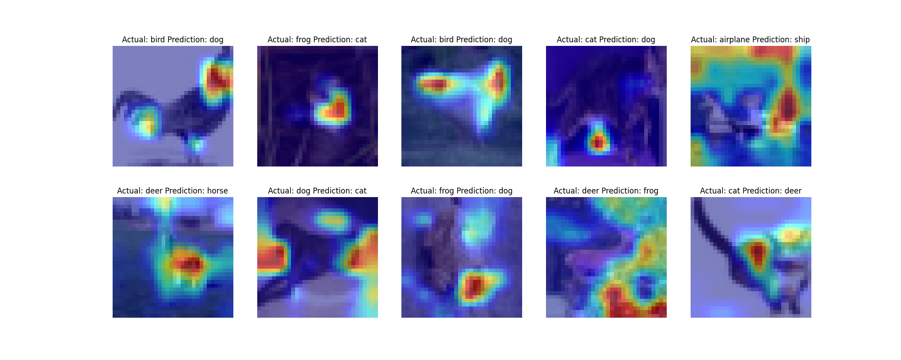

# Assignment
1. pull your Github code to Google Colab (don't copy-paste code)
2. prove that you are following the above structure
3. that the code in your Google Colab notebook is NOTHING.. barely anything. There should not be any function or class that you can define in your Google Colab Notebook. Everything must be imported from all of your other files
4. your colab file must:
    1. train resnet18 for 20 epochs on the CIFAR10 dataset
    2. show loss curves for test and train datasets
    3. show a gallery of 10 misclassified images
    4. show gradcamLinks to an external site. output on 10 misclassified images. Remember if you are applying GradCAM on a channel that is less than 5px, then please don't bother to submit the assignment. 😡🤬🤬🤬🤬
5. Once done, upload the code to GitHub, and share the code. This readme must link to the main repo so we can read your file structure. 
6. Train for 20 epochs
7. Get 10 misclassified images
8. Get 10 GradCam outputs on any misclassified images (remember that you MUST use the library we discussed in class)
9. Apply these transforms while training:
    1. RandomCrop(32, padding=4)
    2. CutOut(16x16)

# Introduction
The goal of this assignment is make code moduler and use grad-CAM to diagnose model model predictions.

## Model architecture

## Output of image augmentation

## Training log
    Epoch 1
    Train: Loss=1.7223 Batch_id=390 Accuracy=24.92: 100%|██████████| 391/391 [00:43<00:00,  9.09it/s]
    Test set: Average loss: 1.6358, Accuracy: 3873/10000 (38.73%)

    Epoch 2
    Train: Loss=1.2629 Batch_id=390 Accuracy=40.83: 100%|██████████| 391/391 [00:41<00:00,  9.41it/s]
    Test set: Average loss: 1.4474, Accuracy: 4785/10000 (47.85%)

    Epoch 3
    Train: Loss=1.3742 Batch_id=390 Accuracy=49.55: 100%|██████████| 391/391 [00:41<00:00,  9.31it/s]
    Test set: Average loss: 1.2690, Accuracy: 5390/10000 (53.90%)

    Epoch 4
    Train: Loss=1.2653 Batch_id=390 Accuracy=55.71: 100%|██████████| 391/391 [00:41<00:00,  9.34it/s]
    Test set: Average loss: 1.1059, Accuracy: 5969/10000 (59.69%)

    Epoch 5
    Train: Loss=0.9823 Batch_id=390 Accuracy=60.38: 100%|██████████| 391/391 [00:41<00:00,  9.38it/s]
    Test set: Average loss: 1.0033, Accuracy: 6381/10000 (63.81%)

    Epoch 6
    Train: Loss=0.9476 Batch_id=390 Accuracy=63.66: 100%|██████████| 391/391 [00:42<00:00,  9.30it/s]
    Test set: Average loss: 1.0057, Accuracy: 6512/10000 (65.12%)

    Epoch 7
    Train: Loss=1.1233 Batch_id=390 Accuracy=66.38: 100%|██████████| 391/391 [00:41<00:00,  9.35it/s]
    Test set: Average loss: 0.8503, Accuracy: 7009/10000 (70.09%)

    Epoch 8
    Train: Loss=0.9029 Batch_id=390 Accuracy=68.69: 100%|██████████| 391/391 [00:41<00:00,  9.32it/s]
    Test set: Average loss: 0.7289, Accuracy: 7456/10000 (74.56%)

    Epoch 9
    Train: Loss=0.7805 Batch_id=390 Accuracy=71.00: 100%|██████████| 391/391 [00:41<00:00,  9.34it/s]
    Test set: Average loss: 0.7244, Accuracy: 7482/10000 (74.82%)

    Epoch 10
    Train: Loss=0.6806 Batch_id=390 Accuracy=72.67: 100%|██████████| 391/391 [00:42<00:00,  9.31it/s]
    Test set: Average loss: 0.7114, Accuracy: 7439/10000 (74.39%)

    Epoch 11
    Train: Loss=0.6413 Batch_id=390 Accuracy=74.62: 100%|██████████| 391/391 [00:41<00:00,  9.36it/s]
    Test set: Average loss: 0.6612, Accuracy: 7762/10000 (77.62%)

    Epoch 12
    Train: Loss=0.5805 Batch_id=390 Accuracy=76.28: 100%|██████████| 391/391 [00:41<00:00,  9.32it/s]
    Test set: Average loss: 0.5740, Accuracy: 8047/10000 (80.47%)

    Epoch 13
    Train: Loss=0.6183 Batch_id=390 Accuracy=77.82: 100%|██████████| 391/391 [00:41<00:00,  9.32it/s]
    Test set: Average loss: 0.5303, Accuracy: 8171/10000 (81.71%)

    Epoch 14
    Train: Loss=0.6231 Batch_id=390 Accuracy=78.95: 100%|██████████| 391/391 [00:41<00:00,  9.38it/s]
    Test set: Average loss: 0.5240, Accuracy: 8234/10000 (82.34%)

    Epoch 15
    Train: Loss=0.6273 Batch_id=390 Accuracy=80.20: 100%|██████████| 391/391 [00:41<00:00,  9.34it/s]
    Test set: Average loss: 0.4896, Accuracy: 8308/10000 (83.08%)

    Epoch 16
    Train: Loss=0.5580 Batch_id=390 Accuracy=81.19: 100%|██████████| 391/391 [00:41<00:00,  9.33it/s]
    Test set: Average loss: 0.5252, Accuracy: 8220/10000 (82.20%)

    Epoch 17
    Train: Loss=0.3593 Batch_id=390 Accuracy=82.22: 100%|██████████| 391/391 [00:41<00:00,  9.34it/s]
    Test set: Average loss: 0.4511, Accuracy: 8506/10000 (85.06%)

    Epoch 18
    Train: Loss=0.5912 Batch_id=390 Accuracy=82.89: 100%|██████████| 391/391 [00:41<00:00,  9.34it/s]
    Test set: Average loss: 0.4519, Accuracy: 8486/10000 (84.86%)

    Epoch 19
    Train: Loss=0.5724 Batch_id=390 Accuracy=83.79: 100%|██████████| 391/391 [00:41<00:00,  9.36it/s]
    Test set: Average loss: 0.4388, Accuracy: 8530/10000 (85.30%)

    Epoch 20
    Train: Loss=0.3656 Batch_id=390 Accuracy=84.58: 100%|██████████| 391/391 [00:41<00:00,  9.38it/s]
    Test set: Average loss: 0.4316, Accuracy: 8581/10000 (85.81%)

## Performance Graphs

## Misclassified Images

## Grad-CAM Images

## Acknowledgments
This model is trained using repo listed below
* [pytorch_cifar_master](https://github.com/AkashDataScience/pytorch_cifar_master)
* [Grad-CAM](https://github.com/jacobgil/pytorch-grad-cam)