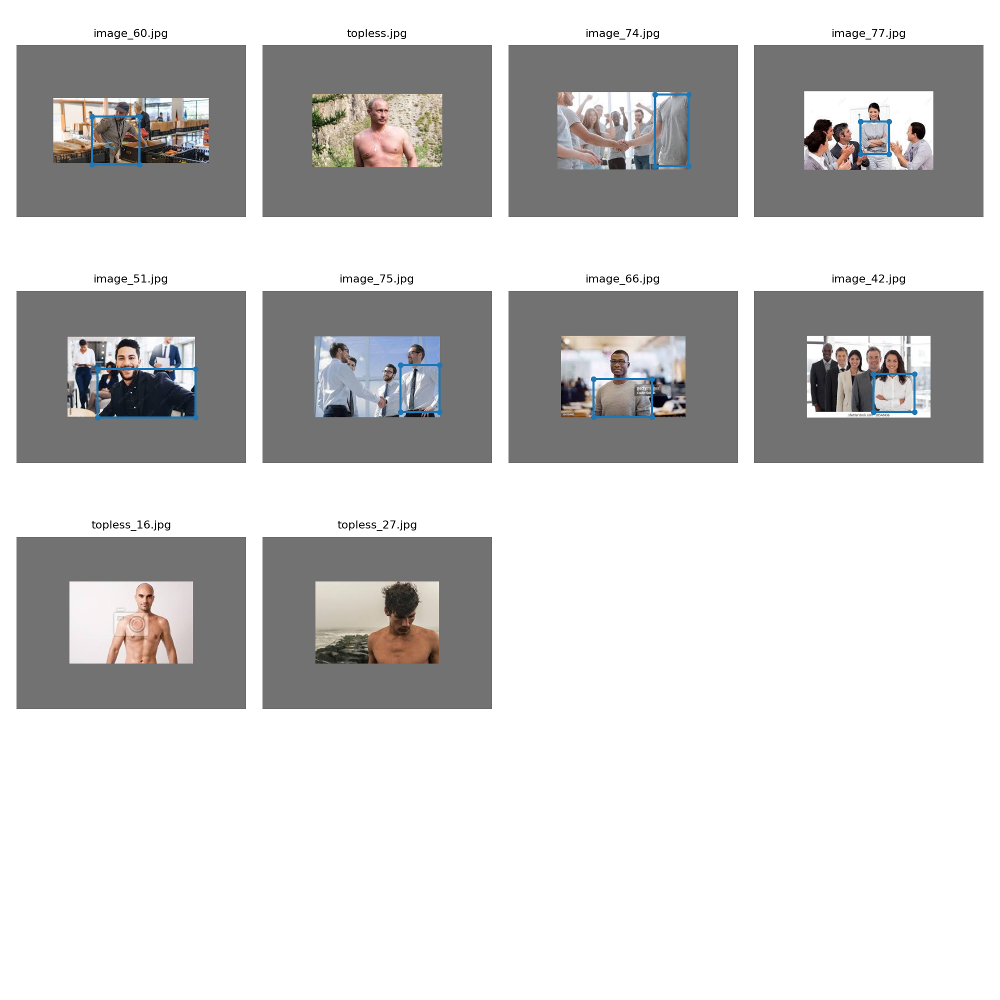

# Assignment
1. Look at this repo: https://github.com/theschoolofai/YoloV3Links to an external site.
2. You're going to retrain the model on your selection images
3. Select 100 images of your choice
4. Use the annotationLinks to an external site. tool. You're going to use this to annotate your images
5. Once trained to "your" acceptable accuracy, upload:
6. Link to your GitHub repo
7. Link to your README where you need to:
    1. show the training log
    2. show YOLOV3 output for 10 images

# Introduction
The goal of this assignment is to collect and annotate images for object detection. I decided to detect shirt/tshirt wore by humans. The tricky part about this detection is if you don't add images with topless people during training and testing, model will start detecting torso instead of shirt/tshirt. 

Once data is collected train YoloV3 model.

## Training log
    Epoch   gpu_mem      GIoU       obj       cls     total   targets  img_size
     1/24     7.75G      4.19      2.14         0      6.33        13       512: 100% 20/20 [00:15<00:00,  1.32it/s]
              Class    Images   Targets         P         R   mAP@0.5        F1: 100% 20/20 [00:04<00:00,  4.38it/s]
                all       200       166         0         0     0.102         0

    Epoch   gpu_mem      GIoU       obj       cls     total   targets  img_size
     2/24     7.75G      3.58      2.34         0      5.92        11       512: 100% 20/20 [00:15<00:00,  1.30it/s]
              Class    Images   Targets         P         R   mAP@0.5        F1: 100% 20/20 [00:04<00:00,  4.25it/s]
                all       200       166         1   0.00602     0.376     0.012
    Epoch   gpu_mem      GIoU       obj       cls     total   targets  img_size
     3/24     7.75G      2.88      1.97         0      4.85        13       512: 100% 20/20 [00:15<00:00,  1.26it/s]
              Class    Images   Targets         P         R   mAP@0.5        F1: 100% 20/20 [00:04<00:00,  4.31it/s]
                all       200       166         0         0     0.491         0

    Epoch   gpu_mem      GIoU       obj       cls     total   targets  img_size
     4/24     7.75G       3.1      2.04         0      5.14        21       512: 100% 20/20 [00:16<00:00,  1.23it/s]
              Class    Images   Targets         P         R   mAP@0.5        F1: 100% 20/20 [00:05<00:00,  3.99it/s]
                all       200       166     0.885     0.193     0.527     0.317

    Epoch   gpu_mem      GIoU       obj       cls     total   targets  img_size
     5/24     7.75G      2.54      1.35         0       3.9        10       512: 100% 20/20 [00:16<00:00,  1.20it/s]
              Class    Images   Targets         P         R   mAP@0.5        F1: 100% 20/20 [00:04<00:00,  4.11it/s]
                all       200       166     0.271     0.458     0.291      0.34

    Epoch   gpu_mem      GIoU       obj       cls     total   targets  img_size
     6/24     7.75G      2.76      1.04         0       3.8        13       512: 100% 20/20 [00:16<00:00,  1.21it/s]
              Class    Images   Targets         P         R   mAP@0.5        F1: 100% 20/20 [00:04<00:00,  4.26it/s]
                all       200       166     0.294     0.471     0.335     0.362

    Epoch   gpu_mem      GIoU       obj       cls     total   targets  img_size
     7/24     7.75G       2.5      1.05         0      3.55        12       512: 100% 20/20 [00:16<00:00,  1.23it/s]
              Class    Images   Targets         P         R   mAP@0.5        F1: 100% 20/20 [00:04<00:00,  4.15it/s]
                all       200       166     0.479     0.316     0.331      0.38

    Epoch   gpu_mem      GIoU       obj       cls     total   targets  img_size
     8/24     7.75G       2.5      1.08         0      3.58        22       512: 100% 20/20 [00:16<00:00,  1.23it/s]
              Class    Images   Targets         P         R   mAP@0.5        F1: 100% 20/20 [00:04<00:00,  4.26it/s]
                all       200       166     0.539     0.148     0.321     0.233

    Epoch   gpu_mem      GIoU       obj       cls     total   targets  img_size
     9/24     7.75G      2.36     0.959         0      3.32        10       512: 100% 20/20 [00:16<00:00,  1.22it/s]
              Class    Images   Targets         P         R   mAP@0.5        F1: 100% 20/20 [00:04<00:00,  4.05it/s]
                all       200       166     0.631     0.229     0.459     0.336

    Epoch   gpu_mem      GIoU       obj       cls     total   targets  img_size
    10/24     7.75G      2.35     0.822         0      3.17        15       512: 100% 20/20 [00:16<00:00,  1.22it/s]
              Class    Images   Targets         P         R   mAP@0.5        F1: 100% 20/20 [00:04<00:00,  4.24it/s]
                all       200       166     0.619      0.48     0.549     0.541

    Epoch   gpu_mem      GIoU       obj       cls     total   targets  img_size
    11/24     7.75G      2.27     0.813         0      3.08        11       512: 100% 20/20 [00:16<00:00,  1.22it/s]
              Class    Images   Targets         P         R   mAP@0.5        F1: 100% 20/20 [00:04<00:00,  4.10it/s]
                all       200       166     0.634      0.48     0.568     0.547

    Epoch   gpu_mem      GIoU       obj       cls     total   targets  img_size
    12/24     7.75G      2.23     0.803         0      3.03        25       512: 100% 20/20 [00:16<00:00,  1.22it/s]
              Class    Images   Targets         P         R   mAP@0.5        F1: 100% 20/20 [00:04<00:00,  4.19it/s]
                all       200       166     0.533     0.717     0.603     0.611

    Epoch   gpu_mem      GIoU       obj       cls     total   targets  img_size
    13/24     7.75G       2.1     0.728         0      2.83        13       512: 100% 20/20 [00:16<00:00,  1.20it/s]
              Class    Images   Targets         P         R   mAP@0.5        F1: 100% 20/20 [00:04<00:00,  4.23it/s]
                all       200       166     0.659     0.633     0.687     0.645

    Epoch   gpu_mem      GIoU       obj       cls     total   targets  img_size
    14/24     7.75G       1.8     0.734         0      2.53        21       512: 100% 20/20 [00:16<00:00,  1.23it/s]
              Class    Images   Targets         P         R   mAP@0.5        F1: 100% 20/20 [00:04<00:00,  4.09it/s]
                all       200       166     0.599     0.737     0.625     0.661

    Epoch   gpu_mem      GIoU       obj       cls     total   targets  img_size
    15/24     7.75G      1.95     0.649         0       2.6        10       512: 100% 20/20 [00:16<00:00,  1.22it/s]
              Class    Images   Targets         P         R   mAP@0.5        F1: 100% 20/20 [00:04<00:00,  4.26it/s]
                all       200       166     0.685     0.721     0.691     0.702

    Epoch   gpu_mem      GIoU       obj       cls     total   targets  img_size
    16/24     7.75G       1.6     0.609         0      2.21        13       512: 100% 20/20 [00:16<00:00,  1.22it/s]
              Class    Images   Targets         P         R   mAP@0.5        F1: 100% 20/20 [00:04<00:00,  4.11it/s]
                all       200       166     0.707     0.683     0.739     0.695

    Epoch   gpu_mem      GIoU       obj       cls     total   targets  img_size
    17/24     7.75G      1.42     0.615         0      2.04        22       512: 100% 20/20 [00:16<00:00,  1.23it/s]
              Class    Images   Targets         P         R   mAP@0.5        F1: 100% 20/20 [00:04<00:00,  4.17it/s]
                all       200       166     0.706     0.705     0.747     0.706

    Epoch   gpu_mem      GIoU       obj       cls     total   targets  img_size
    18/24     7.75G      1.37     0.569         0      1.94        13       512: 100% 20/20 [00:16<00:00,  1.22it/s]
              Class    Images   Targets         P         R   mAP@0.5        F1: 100% 20/20 [00:04<00:00,  4.24it/s]
                all       200       166     0.771     0.829     0.813     0.799

    Epoch   gpu_mem      GIoU       obj       cls     total   targets  img_size
    19/24     7.75G      1.59     0.562         0      2.16        20       512: 100% 20/20 [00:16<00:00,  1.22it/s]
              Class    Images   Targets         P         R   mAP@0.5        F1: 100% 20/20 [00:04<00:00,  4.06it/s]
                all       200       166     0.826     0.774     0.836     0.799

    Epoch   gpu_mem      GIoU       obj       cls     total   targets  img_size
    20/24     7.75G      1.73     0.613         0      2.34        13       512: 100% 20/20 [00:16<00:00,  1.22it/s]
              Class    Images   Targets         P         R   mAP@0.5        F1: 100% 20/20 [00:04<00:00,  4.21it/s]
                all       200       166     0.833     0.719     0.836     0.772

    Epoch   gpu_mem      GIoU       obj       cls     total   targets  img_size
    21/24     7.75G      1.42     0.547         0      1.97        11       512: 100% 20/20 [00:16<00:00,  1.22it/s]
              Class    Images   Targets         P         R   mAP@0.5        F1: 100% 20/20 [00:04<00:00,  4.12it/s]
                all       200       166     0.846     0.728      0.83     0.783

    Epoch   gpu_mem      GIoU       obj       cls     total   targets  img_size
    22/24     7.75G      1.49     0.534         0      2.02        14       512: 100% 20/20 [00:16<00:00,  1.22it/s]
              Class    Images   Targets         P         R   mAP@0.5        F1: 100% 20/20 [00:04<00:00,  4.16it/s]
                all       200       166     0.826     0.747     0.833     0.785

    Epoch   gpu_mem      GIoU       obj       cls     total   targets  img_size
    23/24     7.75G      1.34     0.494         0      1.84        14       512: 100% 20/20 [00:16<00:00,  1.21it/s]
              Class    Images   Targets         P         R   mAP@0.5        F1: 100% 20/20 [00:04<00:00,  4.24it/s]
                all       200       166     0.822     0.753     0.835     0.786

    Epoch   gpu_mem      GIoU       obj       cls     total   targets  img_size
    24/24     7.75G      1.21     0.525         0      1.74        13       512: 100% 20/20 [00:16<00:00,  1.22it/s]
              Class    Images   Targets         P         R   mAP@0.5        F1: 100% 20/20 [00:04<00:00,  4.09it/s]
                all       200       166      0.81     0.813      0.84     0.811

## Output

## Acknowledgments
This model is trained using repo listed below
* [Annotation Tool](https://github.com/miki998/YoloV3_Annotation_Tool)
* [YOLOV3](https://github.com/AkashDataScience/YoloV3?tab=readme-ov-file)
* [YOLOV3 TSAI](https://github.com/theschoolofai/YoloV3)