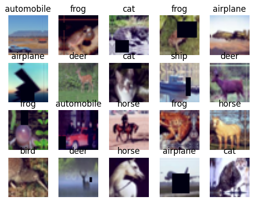
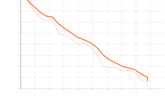
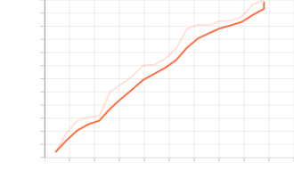
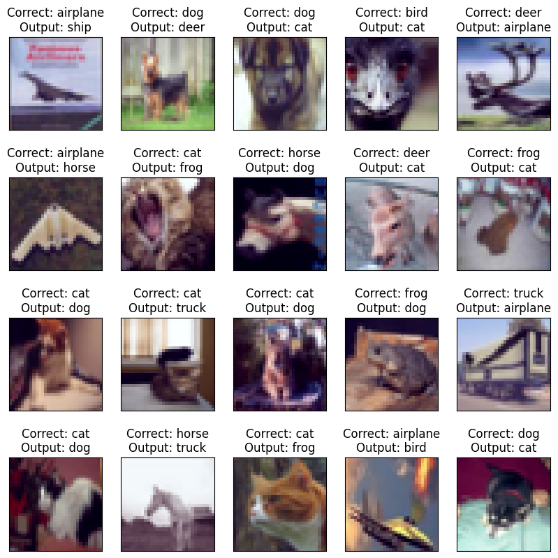
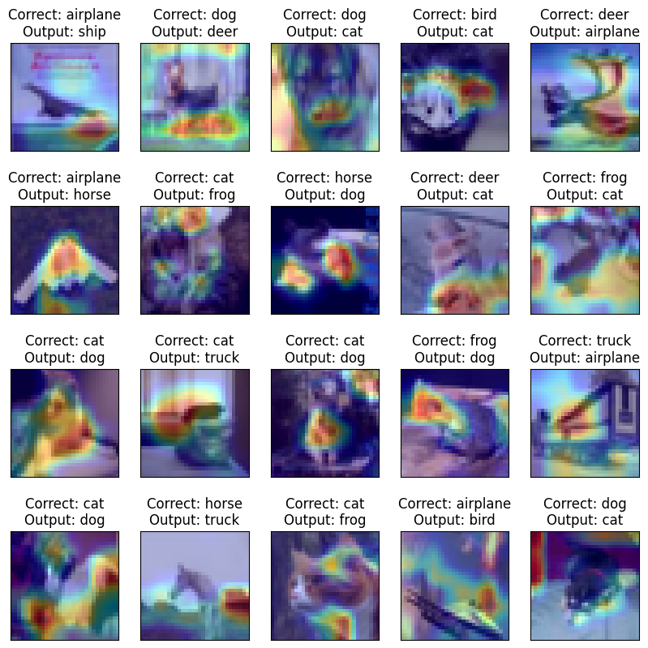

# Assignment
1. (You have retrained your model on Lightning)
2. You are using Gradio
3. Your spaces app has these features:
    1. ask the user whether he/she wants to see GradCAM images and how many, and from which layer, allow opacity change as well
    2. ask whether he/she wants to view misclassified images, and how many
    3. allow users to upload new images, as well as provide 10 example images
    4. ask how many top classes are to be shown (make sure the user cannot enter more than 10)
4. Add the full details on what your App is doing to Spaces README 

# Introduction
The goal of this assignment is to use Lightning and train ResNet model on CIFAR10 dataser. Second goal 
is to create a gradio app on huggingface spaces with features like top N classifications and grad-cam results.

## Model summary

        BatchNorm2d-2           [-1, 64, 32, 32]             128
             Conv2d-3           [-1, 64, 32, 32]          36,864
        BatchNorm2d-4           [-1, 64, 32, 32]             128
             Conv2d-5           [-1, 64, 32, 32]          36,864
        BatchNorm2d-6           [-1, 64, 32, 32]             128
         BasicBlock-7           [-1, 64, 32, 32]               0
             Conv2d-8           [-1, 64, 32, 32]          36,864
        BatchNorm2d-9           [-1, 64, 32, 32]             128
            Conv2d-10           [-1, 64, 32, 32]          36,864
       BatchNorm2d-11           [-1, 64, 32, 32]             128
        BasicBlock-12           [-1, 64, 32, 32]               0
            Conv2d-13          [-1, 128, 16, 16]          73,728
       BatchNorm2d-14          [-1, 128, 16, 16]             256
            Conv2d-15          [-1, 128, 16, 16]         147,456
       BatchNorm2d-16          [-1, 128, 16, 16]             256
            Conv2d-17          [-1, 128, 16, 16]           8,192
       BatchNorm2d-18          [-1, 128, 16, 16]             256
        BasicBlock-19          [-1, 128, 16, 16]               0
            Conv2d-20          [-1, 128, 16, 16]         147,456
       BatchNorm2d-21          [-1, 128, 16, 16]             256
            Conv2d-22          [-1, 128, 16, 16]         147,456
       BatchNorm2d-23          [-1, 128, 16, 16]             256
        BasicBlock-24          [-1, 128, 16, 16]               0
            Conv2d-25            [-1, 256, 8, 8]         294,912
       BatchNorm2d-26            [-1, 256, 8, 8]             512
            Conv2d-27            [-1, 256, 8, 8]         589,824
       BatchNorm2d-28            [-1, 256, 8, 8]             512
            Conv2d-29            [-1, 256, 8, 8]          32,768
       BatchNorm2d-30            [-1, 256, 8, 8]             512
        BasicBlock-31            [-1, 256, 8, 8]               0
            Conv2d-32            [-1, 256, 8, 8]         589,824
       BatchNorm2d-33            [-1, 256, 8, 8]             512
            Conv2d-34            [-1, 256, 8, 8]         589,824
       BatchNorm2d-35            [-1, 256, 8, 8]             512
        BasicBlock-36            [-1, 256, 8, 8]               0
            Conv2d-37            [-1, 512, 4, 4]       1,179,648
       BatchNorm2d-38            [-1, 512, 4, 4]           1,024
            Conv2d-39            [-1, 512, 4, 4]       2,359,296
       BatchNorm2d-40            [-1, 512, 4, 4]           1,024
            Conv2d-41            [-1, 512, 4, 4]         131,072
       BatchNorm2d-42            [-1, 512, 4, 4]           1,024
        BasicBlock-43            [-1, 512, 4, 4]               0
            Conv2d-44            [-1, 512, 4, 4]       2,359,296
       BatchNorm2d-45            [-1, 512, 4, 4]           1,024
            Conv2d-46            [-1, 512, 4, 4]       2,359,296
       BatchNorm2d-47            [-1, 512, 4, 4]           1,024
        BasicBlock-48            [-1, 512, 4, 4]               0
            Linear-49                   [-1, 10]           5,130
    ================================================================
    Total params: 11,173,962
    Trainable params: 11,173,962
    Non-trainable params: 0
    ----------------------------------------------------------------
    Input size (MB): 0.01
    Forward/backward pass size (MB): 11.25
    Params size (MB): 42.63
    Estimated Total Size (MB): 53.89
    ----------------------------------------------------------------

## Output of image augmentation

## Training log
    Epoch 19: 100% 88/88 [00:36<00:00,  2.40it/s, v_num=0, val_loss=0.707, val_acc=0.751]

## Performance Graphs
Loss Graph  
  
Accuracy Graph  

## Misclassified Images

## Grad-CAM Images

## Acknowledgments
This model is trained using repo listed below
* [Grad-CAM](https://github.com/jacobgil/pytorch-grad-cam)