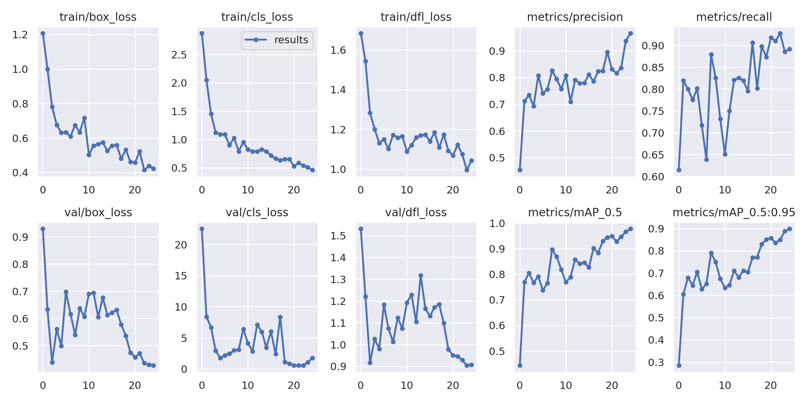
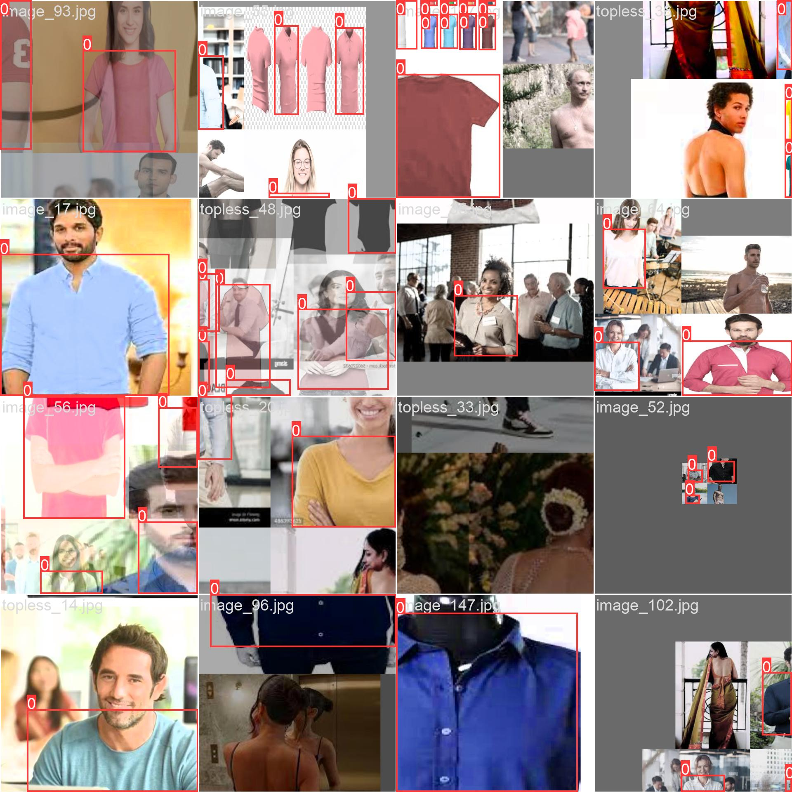

# Assignment
1. Set up training of your v9 on Colab, making sure everything is ready
2. Move training to AWS. 
3. Download the model, and mode the model to HuggingFace, and deploy your Gradio app with couple of examples

# Introduction
The goal of this assignment is to collect and annotate images for object detection. I decided to detect shirt/tshirt wore by humans standing in front of image. There are two main challenges in this problem:
1. Detect tshirt only in front of image.
2. Make sure model learns to detect tshirt and not torso. 

Once data is collected train YOLOv9 model.

## Training log
    Starting training for 25 epochs...

      Epoch    GPU_mem   box_loss   cls_loss   dfl_loss  Instances       Size
       0/24      10.9G      1.207      2.877      1.683         15        640: 1
                 Class     Images  Instances          P          R      mAP50   
                   all        200        166      0.454      0.614      0.444      0.285

      Epoch    GPU_mem   box_loss   cls_loss   dfl_loss  Instances       Size
       1/24      13.3G          1      2.055      1.543         17        640: 1
                 Class     Images  Instances          P          R      mAP50   
                   all        200        166      0.712      0.819      0.769      0.606

      Epoch    GPU_mem   box_loss   cls_loss   dfl_loss  Instances       Size
       2/24      13.3G     0.7818       1.45      1.283         19        640: 1
                 Class     Images  Instances          P          R      mAP50   
                   all        200        166      0.734        0.8      0.805       0.68

      Epoch    GPU_mem   box_loss   cls_loss   dfl_loss  Instances       Size
       3/24      13.3G     0.6771      1.122      1.201         21        640: 1
                 Class     Images  Instances          P          R      mAP50   
                   all        200        166      0.693      0.775      0.767      0.645

      Epoch    GPU_mem   box_loss   cls_loss   dfl_loss  Instances       Size
       4/24      13.3G     0.6317      1.093      1.132         20        640: 1
                 Class     Images  Instances          P          R      mAP50   
                   all        200        166      0.808      0.801      0.792      0.704

      Epoch    GPU_mem   box_loss   cls_loss   dfl_loss  Instances       Size
       5/24      13.3G     0.6341      1.088      1.149         23        640: 1
                 Class     Images  Instances          P          R      mAP50   
                   all        200        166      0.741      0.717      0.738      0.628

      Epoch    GPU_mem   box_loss   cls_loss   dfl_loss  Instances       Size
       6/24      13.3G     0.6098     0.8993      1.103         26        640: 1
                 Class     Images  Instances          P          R      mAP50   
                   all        200        166      0.756      0.639      0.765      0.652

      Epoch    GPU_mem   box_loss   cls_loss   dfl_loss  Instances       Size
       7/24      13.3G     0.6751      1.028      1.172         12        640: 1
                 Class     Images  Instances          P          R      mAP50   
                   all        200        166      0.826       0.88      0.897       0.79

      Epoch    GPU_mem   box_loss   cls_loss   dfl_loss  Instances       Size
       8/24      13.3G     0.6337     0.7909      1.158         22        640: 1
                 Class     Images  Instances          P          R      mAP50   
                   all        200        166      0.795      0.825      0.868       0.75

      Epoch    GPU_mem   box_loss   cls_loss   dfl_loss  Instances       Size
       9/24      13.3G     0.7179      0.954      1.166         16        640: 1
                 Class     Images  Instances          P          R      mAP50   
                   all        200        166      0.757      0.731      0.818      0.674
  Closing dataloader mosaic

      Epoch    GPU_mem   box_loss   cls_loss   dfl_loss  Instances       Size
      10/24      13.3G     0.5033     0.8238       1.09          6        640: 1
                 Class     Images  Instances          P          R      mAP50   
                   all        200        166      0.808      0.651      0.769      0.634

      Epoch    GPU_mem   box_loss   cls_loss   dfl_loss  Instances       Size
      11/24      13.3G     0.5564     0.7852      1.121          7        640: 1
                 Class     Images  Instances          P          R      mAP50   
                   all        200        166      0.709       0.75      0.788      0.646

      Epoch    GPU_mem   box_loss   cls_loss   dfl_loss  Instances       Size
      12/24      13.3G     0.5655     0.7884      1.159          5        640: 1
                 Class     Images  Instances          P          R      mAP50   
                   all        200        166      0.791       0.82      0.857      0.711

      Epoch    GPU_mem   box_loss   cls_loss   dfl_loss  Instances       Size
      13/24      13.3G     0.5748     0.8239       1.17         11        640: 1
                 Class     Images  Instances          P          R      mAP50   
                   all        200        166      0.778      0.825      0.841      0.681

      Epoch    GPU_mem   box_loss   cls_loss   dfl_loss  Instances       Size
      14/24      13.3G     0.5258       0.79      1.173          6        640: 1
                 Class     Images  Instances          P          R      mAP50   
                   all        200        166       0.78      0.819      0.845      0.711

      Epoch    GPU_mem   box_loss   cls_loss   dfl_loss  Instances       Size
      15/24      13.3G     0.5545     0.7191       1.14          8        640: 1
                 Class     Images  Instances          P          R      mAP50   
                   all        200        166      0.811      0.795      0.827      0.704

      Epoch    GPU_mem   box_loss   cls_loss   dfl_loss  Instances       Size
      16/24      13.3G     0.5594     0.6622      1.185          6        640: 1
                 Class     Images  Instances          P          R      mAP50   
                   all        200        166      0.786      0.906      0.901      0.769

      Epoch    GPU_mem   box_loss   cls_loss   dfl_loss  Instances       Size
      17/24      13.3G     0.4813     0.6319      1.109          6        640: 1
                 Class     Images  Instances          P          R      mAP50   
                   all        200        166      0.823      0.801      0.883      0.771

      Epoch    GPU_mem   box_loss   cls_loss   dfl_loss  Instances       Size
      18/24      13.3G     0.5323     0.6536      1.173          5        640: 1
                 Class     Images  Instances          P          R      mAP50   
                   all        200        166      0.825      0.898      0.929       0.83

      Epoch    GPU_mem   box_loss   cls_loss   dfl_loss  Instances       Size
      19/24      13.3G     0.4622     0.6529      1.093          6        640: 1
                 Class     Images  Instances          P          R      mAP50   
                   all        200        166      0.895      0.873      0.944      0.851

      Epoch    GPU_mem   box_loss   cls_loss   dfl_loss  Instances       Size
      20/24      13.3G      0.458     0.5285      1.069          7        640: 1
                 Class     Images  Instances          P          R      mAP50   
                   all        200        166      0.831      0.917      0.949      0.858

      Epoch    GPU_mem   box_loss   cls_loss   dfl_loss  Instances       Size
      21/24      13.3G     0.5215     0.5863      1.122          4        640: 1
                 Class     Images  Instances          P          R      mAP50   
                   all        200        166      0.816       0.91      0.927      0.837

      Epoch    GPU_mem   box_loss   cls_loss   dfl_loss  Instances       Size
      22/24      13.3G     0.4149     0.5389      1.076          6        640: 1
                 Class     Images  Instances          P          R      mAP50   
                   all        200        166      0.837      0.928      0.946       0.85

      Epoch    GPU_mem   box_loss   cls_loss   dfl_loss  Instances       Size
      23/24      13.3G     0.4383     0.5065     0.9957          7        640: 1
                 Class     Images  Instances          P          R      mAP50   
                   all        200        166      0.937      0.886      0.966      0.888

      Epoch    GPU_mem   box_loss   cls_loss   dfl_loss  Instances       Size
      24/24      13.3G     0.4239     0.4602      1.043          8        640: 1
                 Class     Images  Instances          P          R      mAP50   
                   all        200        166      0.966      0.892      0.978      0.899

## Performance Graphs

## Training Batch

## Predictions

## Acknowledgments
This model is trained using repo listed below
* [Annotation Tool](https://github.com/miki998/YoloV3_Annotation_Tool)
* [yolov9](https://github.com/WongKinYiu/yolov9)