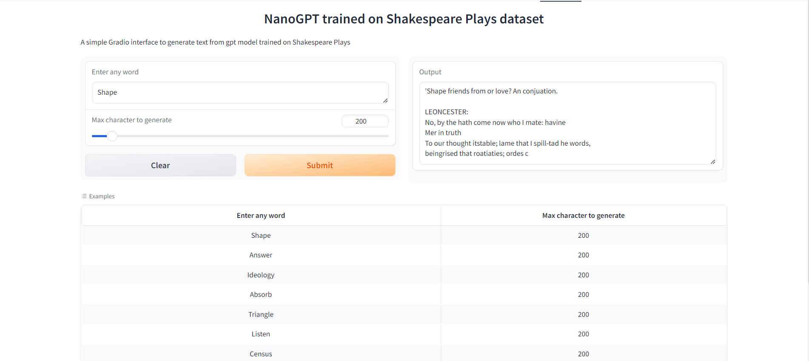

# Assignment
1. Your assignment is to write the train nanoGPT model for language generation task.
2. Upload the model to HuggingFace Apps. 

# Introduction
The goal of this assignment is to follow the Andrej Karpathy's
[video](https://www.youtube.com/watch?v=kCc8FmEb1nY&t=2s) to train language generation model and
deploy it on HuggingFace.

## Training log
    Step 0: train loss 4.2757, val loss 4.2714
    Step 500: train loss 2.3856, val loss 2.4127
    Step 1000: train loss 2.0637, val loss 2.1208
    Step 1500: train loss 1.8448, val loss 1.9613
    Step 2000: train loss 1.6916, val loss 1.8546
    Step 2500: train loss 1.5915, val loss 1.7748
    Step 3000: train loss 1.5146, val loss 1.7152
    Step 3500: train loss 1.4571, val loss 1.6665
    Step 4000: train loss 1.4150, val loss 1.6313
    Step 4500: train loss 1.3756, val loss 1.5976
    100%|██████████| 5000/5000 [1:03:50<00:00,  1.31it/s]

    Air tribunes comming to seal thoughs me to plut,
    And noble at oritoguly right thesek,
    Is it up writther make a wold fury deed.

    KING RICHARD II:
    Harry, that is strought to your Duke:
    Herre wears not moving be,
    Lord them defore, abours, sir
    Than flance, patient stand me to confey's is mad
    To from gozen the coes these traity.

    KING HENRY VI:
    My let thee, then queen it friends whitt be Tybles,
    As I halpoung him, you father and the baste
    The once our to the word and many time,
    Undo cersmand I dead u

## Metrics
val loss: 1.5976

## Gradio App
  
Gradio App can be found [here](https://huggingface.co/spaces/AkashDataScience/nanoGPT)

## Acknowledgments
This model is trained using repo listed below
* [nanoGPT](https://github.com/AkashDataScience/nanogpt)