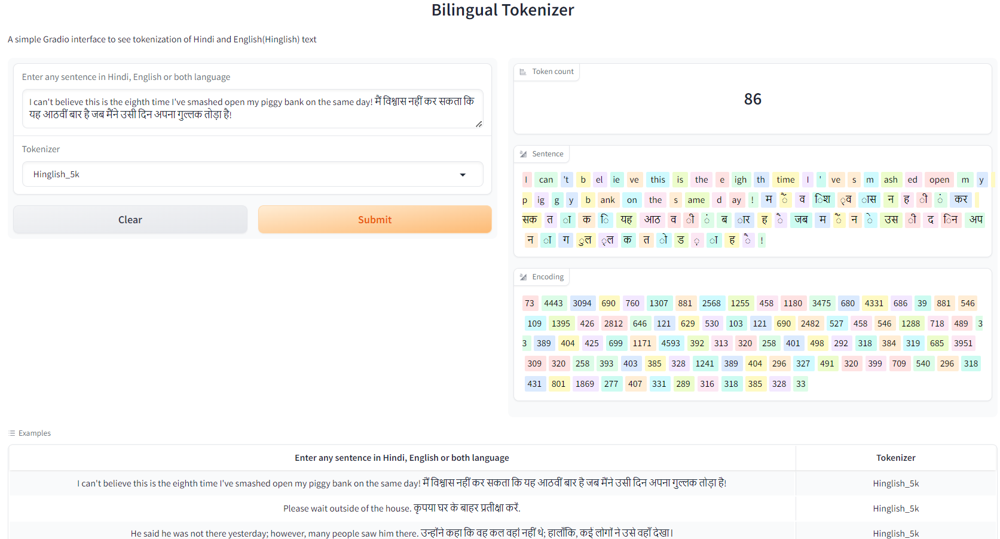

# Assignment
1. Pick any "Indian" language of your choice
2. Build your own BPE for this language that satisfies these statistics:
    1. it must have 5000+ tokens in its vocabulary
    2. it must have a compression ratio of 3 or above
3. Once done:
    1. Share your GitHub link where we can find the training notebook
    2. Upload to HuggingFace (with examples) where we can run your tokenizer

# Introduction
The goal of this assignment is to collect text data of any indian language. Write regext to split
data properly. Build a BPE tokenizer with 5000+ tokens. Final compression should be greater than 3.

## Build logs
### English
    Merging hindi characters in single token
    100%|██████████| 128/128 [00:16<00:00,  7.77it/s]
    Building BPE
    merge 1/4616: (101, 114) -> 384 (er) had 2174 occurrences
    merge 2/4616: (50, 48) -> 385 (20) had 2102 occurrences
    merge 3/4616: (111, 114) -> 386 (or) had 1991 occurrences
    merge 4/4616: (105, 110) -> 387 (in) had 1943 occurrences
    merge 5/4616: (111, 110) -> 388 (on) had 1789 occurrences
    ...
    merge 4610/4616: (3602, 1460) -> 4993 ( Electronic) had 2 occurrences
    merge 4611/4616: (566, 1916) -> 4994 (ulford) had 2 occurrences
    merge 4612/4616: (1052, 3651) -> 4995 ( Provenzano) had 2 occurrences
    merge 4613/4616: (542, 111) -> 4996 ( Vo) had 2 occurrences
    merge 4614/4616: (4996, 2797) -> 4997 ( Voices) had 2 occurrences
    merge 4615/4616: (1523, 611) -> 4998 ( Melod) had 2 occurrences
    merge 4616/4616: (569, 1345) -> 4999 ( Korn) had 2 occurrences
    100%|██████████| 4616/4616 [15:28<00:00,  4.97it/s]
    Compression ratio: 3.577716122078285
    Training took 945.11 seconds

### Hindi
    Spliting hindi words
    100%|██████████| 127577/127577 [00:01<00:00, 103055.80it/s]
    Merging hindi characters in single token
    100%|██████████| 128/128 [01:08<00:00,  1.88it/s]
    Building BPE
    merge 1/4616: (32, 277) -> 384 ( क) had 13803 occurrences
    merge 2/4616: (32, 313) -> 385 ( ह) had 12249 occurrences
    merge 3/4616: (356, 10) -> 386 (।
    ) had 12187 occurrences
    merge 4/4616: (385, 328) -> 387 ( है) had 7401 occurrences
    merge 5/4616: (32, 312) -> 388 ( स) had 6436 occurrences
    ...
    merge 4610/4616: (384, 431) -> 4993 ( कड़) had 4 occurrences
    merge 4611/4616: (1606, 604) -> 4994 (व्यस्त) had 4 occurrences
    merge 4612/4616: (671, 635) -> 4995 (न्जी) had 4 occurrences
    merge 4613/4616: (568, 820) -> 4996 (ढ़ियों) had 4 occurrences
    merge 4614/4616: (659, 513) -> 4997 (ंडित) had 4 occurrences
    merge 4615/4616: (1147, 306) -> 4998 ( ओल) had 4 occurrences
    merge 4616/4616: (767, 320) -> 4999 ( रखी) had 4 occurrences
    100%|██████████| 4616/4616 [43:12<00:00,  1.78it/s]
    Compression ratio: 3.2640038023051474
    Training took 2662.83 seconds

### Hindi and English(Hinglish)
    Spliting hindi words
    100%|██████████| 172038/172038 [00:01<00:00, 100698.13it/s]
    Merging hindi characters in single token
    100%|██████████| 128/128 [01:29<00:00,  1.44it/s]
    Building BPE
    merge 1/4616: (32, 277) -> 384 ( क) had 13803 occurrences
    merge 2/4616: (32, 313) -> 385 ( ह) had 12249 occurrences
    merge 3/4616: (356, 10) -> 386 (।
    ) had 12187 occurrences
    merge 4/4616: (385, 328) -> 387 ( है) had 7401 occurrences
    merge 5/4616: (32, 312) -> 388 ( स) had 6436 occurrences
    ...
    merge 4610/4616: (2070, 2131) -> 4993 (दरवाज़े) had 7 occurrences
    merge 4611/4616: (283, 321) -> 4994 (छु) had 7 occurrences
    merge 4612/4616: (284, 581) -> 4995 (जंग) had 7 occurrences
    merge 4613/4616: (1253, 713) -> 4996 ( व्यस्त) had 7 occurrences
    merge 4614/4616: (397, 581) -> 4997 ( जंग) had 7 occurrences
    merge 4615/4616: (2155, 1356) -> 4998 ( युद्ध) had 7 occurrences
    merge 4616/4616: (1738, 1043) -> 4999 ( अम्री) had 7 occurrences
    100%|██████████| 4616/4616 [57:37<00:00,  1.34it/s]
    Compression ratio: 3.095100203054648
    Training took 3548.86 seconds

## Metrics
Compression ratio for Hindi: 3.26
Compression rario for Hinglish: 3.10
Compression ratio for English: 3.58

## Gradio App
  
Gradio App can be found [here](https://huggingface.co/spaces/AkashDataScience/languageBPE)

## Acknowledgments
This model is trained using repo listed below
* [languageBPE](https://github.com/AkashDataScience/language_bpe)