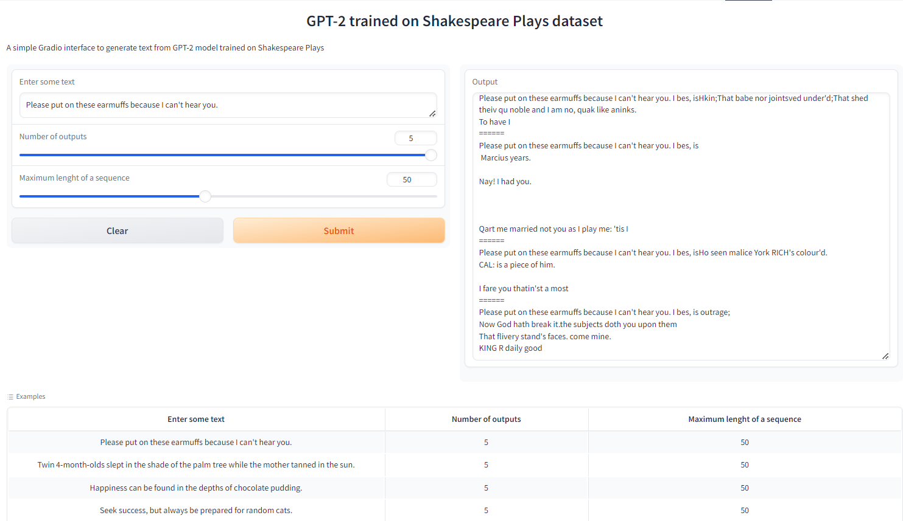

# Assignment
1. On Colab (or your computer), train the GPT-2 124M model on this such that your loss is less than 0.099999
2. Share the GitHub link where we can see the training logs and sample outputs
3. Share the huggingFace app where we can see it running (add a screenshot on GitHub where huggingface output is visible)

# Introduction
The goal of this assignment is to implement GPT-2 model from scratch. Add optimization to speed up
training. Train model to reach 0.1 loss and deploy it on Huggingface.

## Train logs
    using device: cuda
    loaded 338025 tokens
    1 epoch = 20 batches
    num decayed parameter tensors: 50, with 124,354,560 parameters
    num non-decayed parameter tensors: 98, with 121,344 parameters
    using fused AdamW: True
    step0 | loss: 10.97531509399414 | dt: 4774.03ms | tok/sec:  3431.90 | norm: 7.11
    step1 | loss: 9.705127716064453 | dt: 690.78ms | tok/sec:  23718.09 | norm: 5.36
    step2 | loss: 9.325854301452637 | dt: 290.23ms | tok/sec:  56452.33 | norm: 6.38
    step3 | loss: 9.356155395507812 | dt: 290.26ms | tok/sec:  56446.25 | norm: 4.46
    step4 | loss: 8.88800048828125 | dt: 290.89ms | tok/sec:  56323.28 | norm: 3.77
    step5 | loss: 8.705629348754883 | dt: 288.14ms | tok/sec:  56860.53 | norm: 2.09
    step6 | loss: 8.569194793701172 | dt: 288.82ms | tok/sec:  56728.35 | norm: 2.83
    step7 | loss: 8.218268394470215 | dt: 288.93ms | tok/sec:  56706.16 | norm: 2.06
    step8 | loss: 7.8205695152282715 | dt: 288.83ms | tok/sec:  56725.21 | norm: 2.36
    step9 | loss: 7.422621250152588 | dt: 291.44ms | tok/sec:  56217.72 | norm: 1.95
    step10 | loss: 7.032327651977539 | dt: 289.55ms | tok/sec:  56584.20 | norm: 1.56
    ...
    step4798 | loss: 0.0015357111115008593 | dt: 311.53ms | tok/sec:  52592.15 | norm: 0.02
    step4799 | loss: 0.0018159039318561554 | dt: 310.84ms | tok/sec:  52708.93 | norm: 0.01
    step4800 | loss: 0.0018346825381740928 | dt: 313.04ms | tok/sec:  52337.88 | norm: 0.06
    step4801 | loss: 0.002180515555664897 | dt: 311.40ms | tok/sec:  52614.37 | norm: 0.03
    step4802 | loss: 0.004937185440212488 | dt: 316.01ms | tok/sec:  51846.03 | norm: 0.24
    step4803 | loss: 0.0020147250033915043 | dt: 308.69ms | tok/sec:  53075.93 | norm: 0.01
    step4804 | loss: 0.00254041887819767 | dt: 319.35ms | tok/sec:  51304.36 | norm: 0.04
    step4805 | loss: 0.0015267899725586176 | dt: 314.72ms | tok/sec:  52058.24 | norm: 0.01
    step4806 | loss: 0.001465891837142408 | dt: 314.08ms | tok/sec:  52164.86 | norm: 0.02
    step4807 | loss: 0.0025597792118787766 | dt: 311.93ms | tok/sec:  52524.13 | norm: 0.02
    step4808 | loss: 0.0019402028992772102 | dt: 316.26ms | tok/sec:  51806.09 | norm: 0.02

## Metrics
Final loss: 0.0019

## Gradio App
  
Gradio App can be found [here](https://huggingface.co/spaces/AkashDataScience/GPT-2)

## Acknowledgments
This model is trained using repo listed below
* [GPT2](https://github.com/AkashDataScience/gpt2_124M)