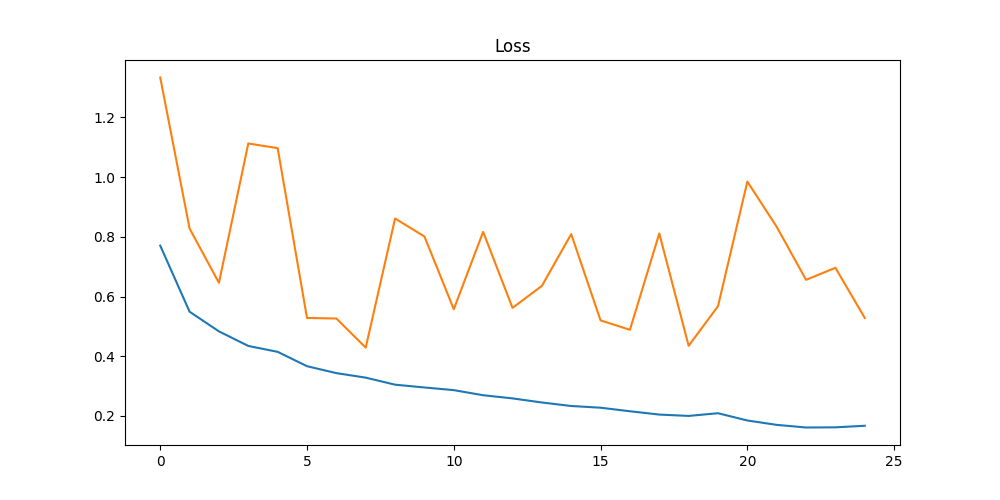
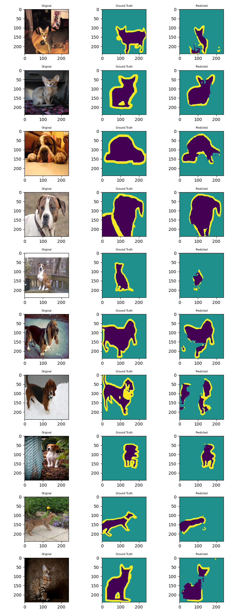
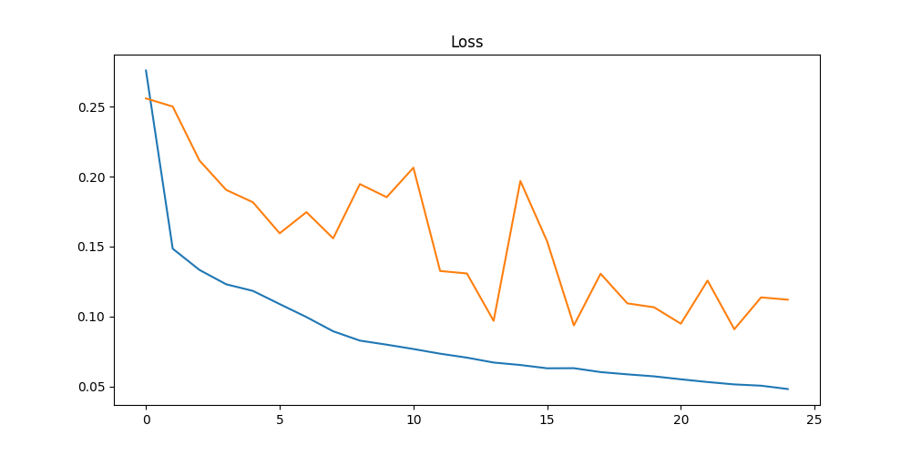
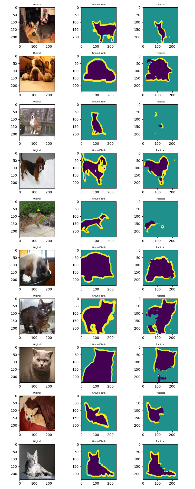
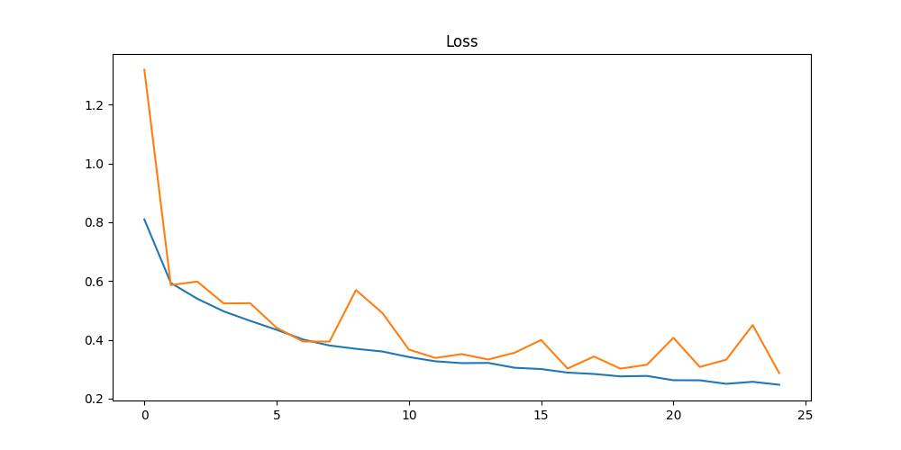
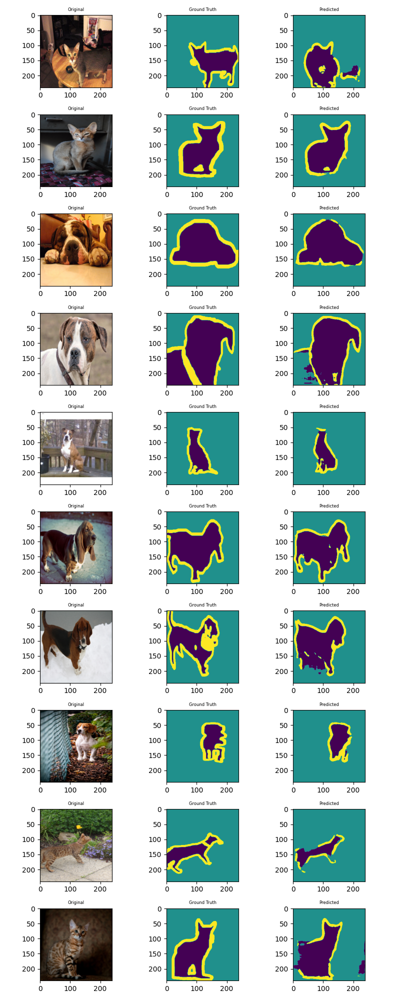
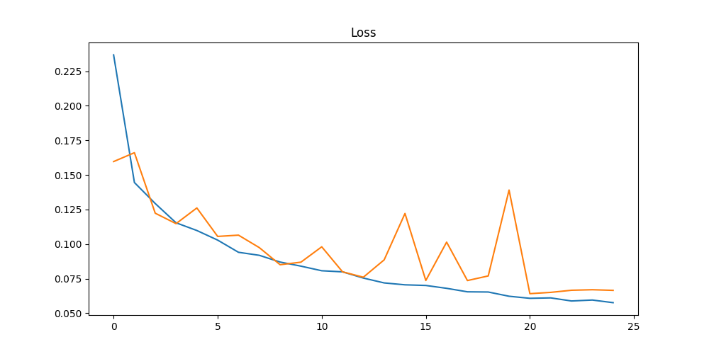
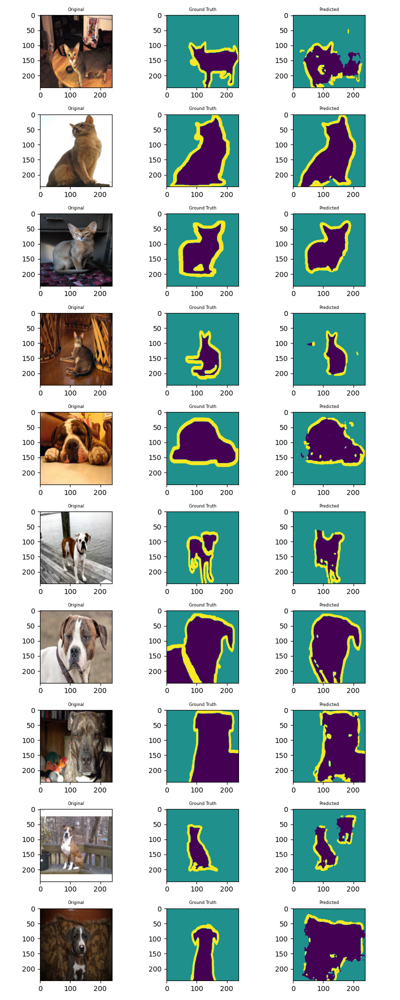

# Assignment
## Part 1

Expand

1. Train your own UNet from scratch 
2. Train 4 times: 
    - MP+Tr+CE 
    - MP+Tr+Dice Loss 
    - StrConv+Tr+CE 
    - StrConv+Ups+Dice Loss 

## Introduction
The goal of this assignment is to implement Unet model from scratch for segmentation task. Train it
with different type of losses and layers.

## MP+Tr+CE
### Train logs
    Epoch 1
    Train: Loss=0.5826 Batch_id=57: 100%|██████████| 58/58 [00:16<00:00,  3.46it/s]
    Test set: Average loss: 1.3338
    Epoch 2
    Train: Loss=0.4544 Batch_id=57: 100%|██████████| 58/58 [00:16<00:00,  3.55it/s]
    Test set: Average loss: 0.8280
    Epoch 3
    Train: Loss=0.4951 Batch_id=57: 100%|██████████| 58/58 [00:16<00:00,  3.51it/s]
    Test set: Average loss: 0.6460
    Epoch 4
    Train: Loss=0.4133 Batch_id=57: 100%|██████████| 58/58 [00:16<00:00,  3.52it/s]
    Test set: Average loss: 1.1128
    Epoch 5
    Train: Loss=0.3978 Batch_id=57: 100%|██████████| 58/58 [00:16<00:00,  3.48it/s]
    Test set: Average loss: 1.0972
    ...
    Epoch 21
    Train: Loss=0.1921 Batch_id=57: 100%|██████████| 58/58 [00:16<00:00,  3.47it/s]
    Test set: Average loss: 0.9850
    Epoch 22
    Train: Loss=0.1754 Batch_id=57: 100%|██████████| 58/58 [00:16<00:00,  3.51it/s]
    Test set: Average loss: 0.8336
    Epoch 23
    Train: Loss=0.1410 Batch_id=57: 100%|██████████| 58/58 [00:16<00:00,  3.53it/s]
    Test set: Average loss: 0.6560
    Epoch 24
    Train: Loss=0.1979 Batch_id=57: 100%|██████████| 58/58 [00:16<00:00,  3.52it/s]
    Test set: Average loss: 0.6963
    Epoch 25
    Train: Loss=0.1930 Batch_id=57: 100%|██████████| 58/58 [00:16<00:00,  3.53it/s]
    Test set: Average loss: 0.5283

### Performance Graph

### Results

## MP+Tr+Dice Loss
### Train logs
    CUDA Available? True
    Epoch 1
    Train: Loss=0.1578 Batch_id=28: 100%|██████████| 29/29 [00:17<00:00,  1.70it/s]
    Test set: Average loss: 0.2559
    Epoch 2
    Train: Loss=0.1554 Batch_id=28: 100%|██████████| 29/29 [00:16<00:00,  1.74it/s]
    Test set: Average loss: 0.2501
    Epoch 3
    Train: Loss=0.1305 Batch_id=28: 100%|██████████| 29/29 [00:16<00:00,  1.73it/s]
    Test set: Average loss: 0.2115
    Epoch 4
    Train: Loss=0.1166 Batch_id=28: 100%|██████████| 29/29 [00:16<00:00,  1.71it/s]
    Test set: Average loss: 0.1905
    Epoch 5
    Train: Loss=0.1199 Batch_id=28: 100%|██████████| 29/29 [00:16<00:00,  1.74it/s]
    Test set: Average loss: 0.1816
    ...
    Epoch 21
    Train: Loss=0.0528 Batch_id=28: 100%|██████████| 29/29 [00:17<00:00,  1.70it/s]
    Test set: Average loss: 0.0948
    Epoch 22
    Train: Loss=0.0504 Batch_id=28: 100%|██████████| 29/29 [00:17<00:00,  1.69it/s]
    Test set: Average loss: 0.1257
    Epoch 23
    Train: Loss=0.0530 Batch_id=28: 100%|██████████| 29/29 [00:16<00:00,  1.72it/s]
    Test set: Average loss: 0.0909
    Epoch 24
    Train: Loss=0.0492 Batch_id=28: 100%|██████████| 29/29 [00:16<00:00,  1.74it/s]
    Test set: Average loss: 0.1136
    Epoch 25
    Train: Loss=0.0448 Batch_id=28: 100%|██████████| 29/29 [00:16<00:00,  1.74it/s]
    Test set: Average loss: 0.1120

### Performance Graph

### Results

## StrConv+Tr+CE
### Train logs
    CUDA Available? True
    Epoch 1
    Train: Loss=0.5796 Batch_id=57: 100%|██████████| 58/58 [00:16<00:00,  3.42it/s]
    Test set: Average loss: 1.3183
    Epoch 2
    Train: Loss=0.5894 Batch_id=57: 100%|██████████| 58/58 [00:16<00:00,  3.41it/s]
    Test set: Average loss: 0.5862
    Epoch 3
    Train: Loss=0.5051 Batch_id=57: 100%|██████████| 58/58 [00:17<00:00,  3.39it/s]
    Test set: Average loss: 0.5981
    Epoch 4
    Train: Loss=0.5162 Batch_id=57: 100%|██████████| 58/58 [00:16<00:00,  3.43it/s]
    Test set: Average loss: 0.5238
    Epoch 5
    Train: Loss=0.4325 Batch_id=57: 100%|██████████| 58/58 [00:16<00:00,  3.42it/s]
    Test set: Average loss: 0.5245
    ...
    Epoch 21
    Train: Loss=0.2533 Batch_id=57: 100%|██████████| 58/58 [00:16<00:00,  3.47it/s]
    Test set: Average loss: 0.4071
    Epoch 22
    Train: Loss=0.2243 Batch_id=57: 100%|██████████| 58/58 [00:16<00:00,  3.47it/s]
    Test set: Average loss: 0.3076
    Epoch 23
    Train: Loss=0.2697 Batch_id=57: 100%|██████████| 58/58 [00:16<00:00,  3.48it/s]
    Test set: Average loss: 0.3325
    Epoch 24
    Train: Loss=0.2400 Batch_id=57: 100%|██████████| 58/58 [00:16<00:00,  3.49it/s]
    Test set: Average loss: 0.4501
    Epoch 25
    Train: Loss=0.2470 Batch_id=57: 100%|██████████| 58/58 [00:16<00:00,  3.41it/s]
    Test set: Average loss: 0.2871

### Performance Graph

### Results

## StrConv+Ups+Dice Loss
### Train logs
    CUDA Available? True
    Epoch 1
    Train: Loss=0.1710 Batch_id=114: 100%|██████████| 115/115 [00:18<00:00,  6.26it/s]
    Test set: Average loss: 0.1596
    Epoch 2
    Train: Loss=0.1415 Batch_id=114: 100%|██████████| 115/115 [00:18<00:00,  6.31it/s]
    Test set: Average loss: 0.1661
    Epoch 3
    Train: Loss=0.1201 Batch_id=114: 100%|██████████| 115/115 [00:18<00:00,  6.29it/s]
    Test set: Average loss: 0.1223
    Epoch 4
    Train: Loss=0.0969 Batch_id=114: 100%|██████████| 115/115 [00:18<00:00,  6.28it/s]
    Test set: Average loss: 0.1148
    Epoch 5
    Train: Loss=0.0990 Batch_id=114: 100%|██████████| 115/115 [00:18<00:00,  6.28it/s]
    Test set: Average loss: 0.1261
    Epoch 20
    Train: Loss=0.0663 Batch_id=114: 100%|██████████| 115/115 [00:17<00:00,  6.42it/s]
    Test set: Average loss: 0.1391
    Epoch 21
    Train: Loss=0.0602 Batch_id=114: 100%|██████████| 115/115 [00:17<00:00,  6.43it/s]
    Test set: Average loss: 0.0642
    Epoch 22
    Train: Loss=0.0613 Batch_id=114: 100%|██████████| 115/115 [00:17<00:00,  6.41it/s]
    Test set: Average loss: 0.0651
    Epoch 23
    Train: Loss=0.0561 Batch_id=114: 100%|██████████| 115/115 [00:18<00:00,  6.34it/s]

### Performance Graph

### Results

## Acknowledgments
This model is trained using repo listed below
* [UNet](https://github.com/AkashDataScience/unet_pytorch)