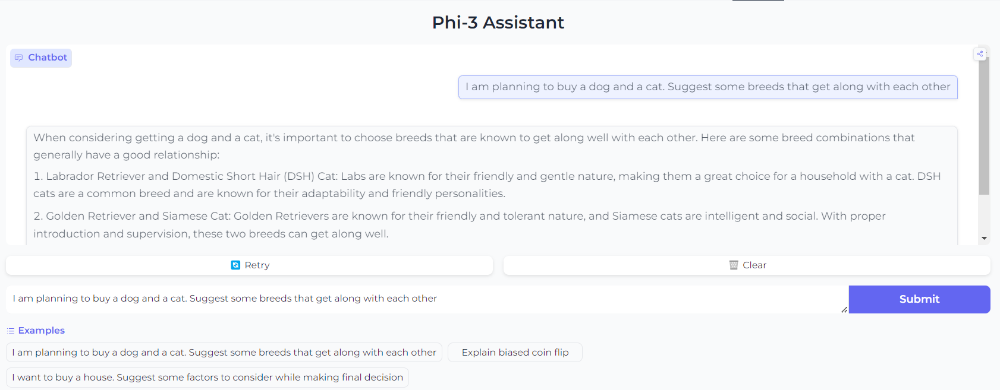

# Assignment
1. Use OpenAssistant dataset to train an LLM model
2. Fine-tune Phi-2, Phi-3 or Phi-3.5 model for assisant/chat task.
3. Use QLoRA strategy to reduce training cost.
4. Once done, upload to Hugging Face Spaces, and share the link for your huggingface app, where I can query your model and see the result!
5. Share with the world!

# Introduction
The goal of this assignment is to use OpenAssistant dataset and Phi-3 model to train a chatbot.
Use Peft, Lora and QLora to train model on a colab notebook. Write inference scrip and deploy it as
HuggingFace app.

## :chart_with_upwards_trend: Train logs

    Step	Training Loss
    20	    1.426200
    40	    1.373900
    60	    1.458000
    80	    1.397000
    100	    1.407600

## Gradio App
  
Gradio App can be found [here](https://huggingface.co/spaces/AkashDataScience/Phi-3_assistant)

## Acknowledgments
This assignement is refering to code given in repo listed below
* [Phi-3 Fine Tuning](https://huggingface.co/spaces/AkashDataScience/Phi-3_assistant)