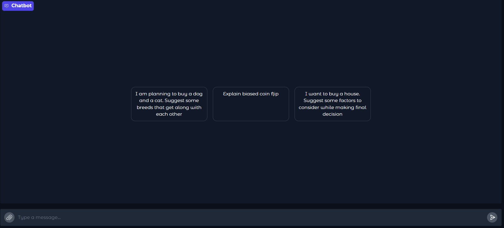

# Assignment
1. You are going to make a multi-modal LLM that can take these inputs:
    1. Text
    2. Image
    3. Audio 
2. The output remains text for us. Here are the training guidelines:
    1. Image:
        1. Use the original Instruct 150k dataset, and use CLIP to get the image embeddings:
            1. either run it in real-time (need more GPU), or store the embeddings (basically preprocess and store)
        2. Add your projection layer from this CLIP embeddings to something that can be fed to your Phi Model (do not apply QLoRa to this payer)
        3. Add an adapter that you'll train (QLoRa) on the instruct 150k dataset
    2. Audio:
        1. You need to use Whisper to perform ASR.
        2. This audio part "should" not require any training, but a pipeline from your end to link it properly to your model
    3. Text:
3. Deployment:
    1. Your deployment page should look like ChatGPT only, where you can send in images, text, or upload audio (live recording or file)
4. Submission:
    1. You're submitting your HuggingFace Spaces App Link
    2. GitHub link where all the files are available
    3. Detailed README file where I can see all the logs
    4. your full description of the project
    5. what else you could have done to improve the project

# Introduction
The goal of this assignment is to use Instruct 150k dataset and train Phi-3 model for multimodality.
Train projection layer to input image embeddings to phi model. Use Peft, Lora and QLora to finetune model
on a colab notebook. Write inference scrip and deploy it as HuggingFace app.

## :chart_with_upwards_trend: Projection layer training

    Epoch 1/3
    Loss: 6.5470 Batch_id=9856: 100%|██████████| 9857/9857 [1:49:31<00:00,  1.50it/s]
    Epoch 2/3
    Loss: 6.3709 Batch_id=9856: 100%|██████████| 9857/9857 [1:49:33<00:00,  1.50it/s]
    Epoch 3/3
    Loss: 6.3691 Batch_id=9856: 100%|██████████| 9857/9857 [1:49:31<00:00,  1.50it/s]
    Training completed and model saved.

## :chart_with_upwards_trend: Finetuning using QLora

    Step	Training Loss
    100	    12.643800
    200	    12.441300
    300	    11.495200
    400	    7.042100
    500	    3.107100
    600	    2.746800
    700	    2.546100
    800	    2.320600
    900	    2.036000
    1000	1.992700
    .
    .
    .
    5100	1.321800
    5200	1.321600
    5300	1.333300
    5400	1.341200
    5500	1.306900
    5600	1.318700
    5700	1.328000
    5800	1.317500
    5900	1.311600
    6000	1.308100

## Gradio App
  
Gradio App can be found [here](https://huggingface.co/spaces/AkashDataScience/Phi-3_multimodel_assistant)

## Acknowledgments
This model is trained using repo listed below
* [Multimodel Phi-3 Fine Tuning](https://github.com/AkashDataScience/multi_model_phi_3)