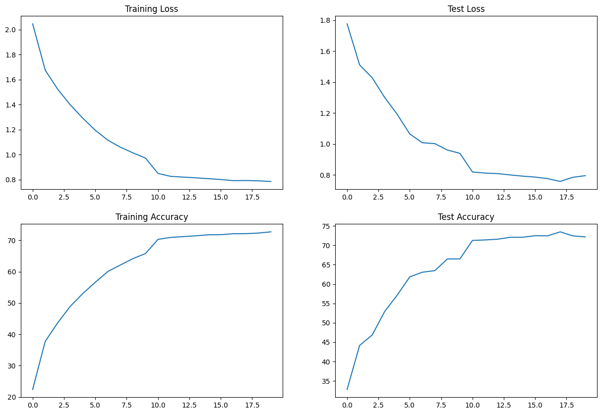
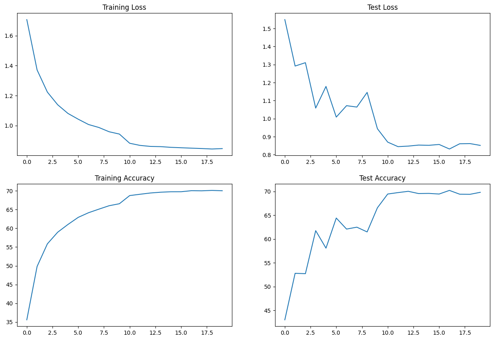
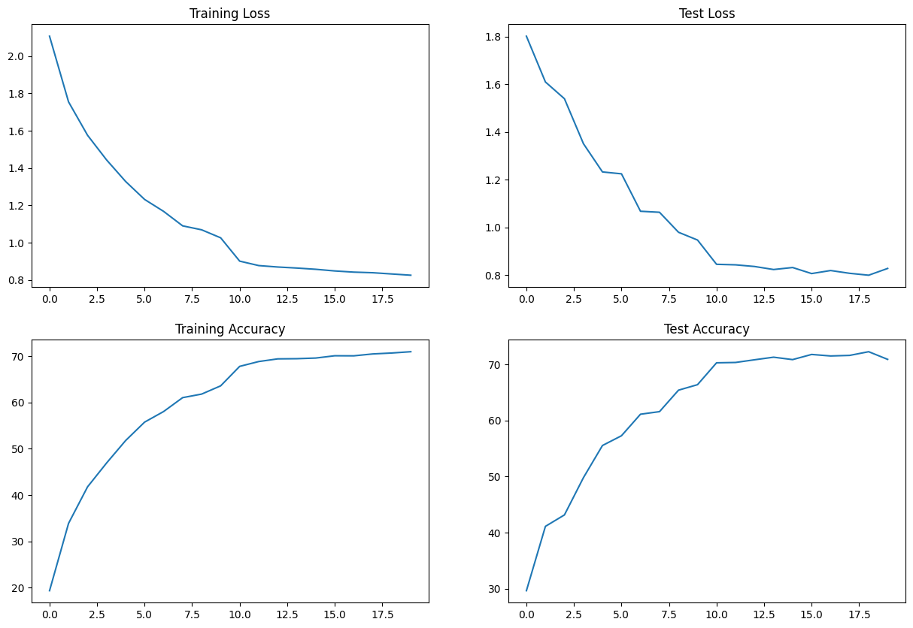
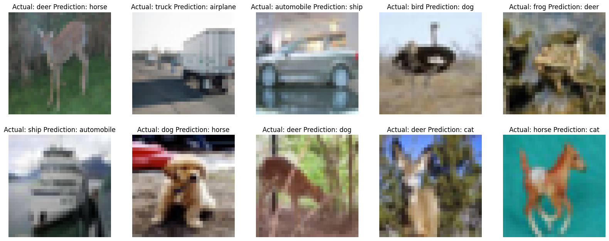
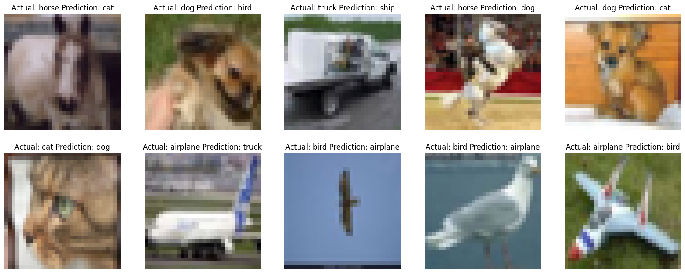
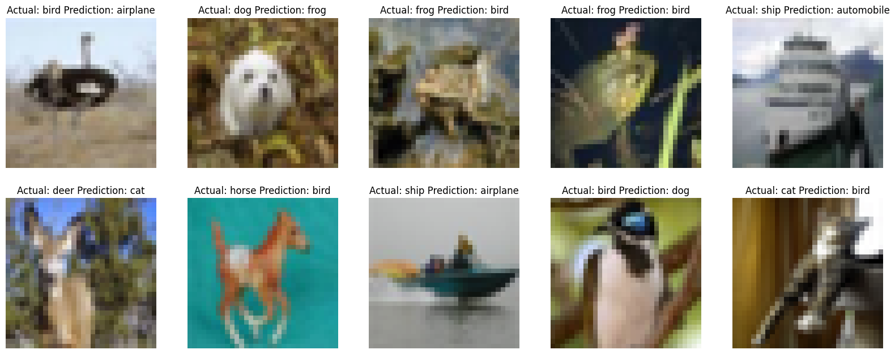

# Assignment
1. Change the dataset to CIFAR10
2. Make this network:
    1. C1 C2 c3 P1 C4 C5 C6 c7 P2 C8 C9 C10 GAP c11
        1. cN is 1x1 Layer
    2. Keep the parameter count less than 50000
    3. Max Epochs is 20
3. You are making 3 versions of the above code (in each case achieve above 70% accuracy):
    1. Network with Group Normalization
    2. Network with Layer Normalization
    3. Network with Batch Normalization
4. Share these details
    1.  Metrics
        1. Training accuracy for 3 models
        2. Test accuracy for 3 models
    2. Find 10 misclassified images for the BN, GN and LN model, and show them as a 5x2 image matrix in 3 separately annotated images. 
    3. write an explanatory README file that explains:
        1. what is your code all about,
        2. your findings for normalization techniques,
        3. add all your graphs
        4. your collection-of-misclassified-images 
4. Upload your complete assignment on GitHub and share the link on LMS

# Introduction
The goal of this assignment is to compare different normalization layer: **GroupNorm**, **BatchNorm** and **LayerNorm**. Three different notebooks are created using three different normalization methods. Each notebook statisfies criteria given in assignment. 

# Metrics
|Model|Notebook|Train Accuracy| Test Accuracy|
|-----|--------|--------------|--------------|
Group Normalization|[GroupNorm](./ERA_V2_S8_GroupNorm.ipynb)|72.71|73.48|
Batch Normalization|[BatchNorm](./ERA_V2_S8_BatchNorm.ipynb)|70.09|70.21
Layer Normalization|[LayerNorm](./ERA_V2_S8_LayerNorm.ipynb)|70.95|72.27

# Findings
Batch normalization acheved 70% accuracy with just 15K parameters. To achieve simillar results Group normalization and Layer normalization needs more parameters for same achitecture. 

# Performance Graphs
## Group Normalization

## Batch Normalization

## Layer Normalizatino

# Misclassified Images
## Group Normalization

## Batch Normalization

## Layer Normalizatino
