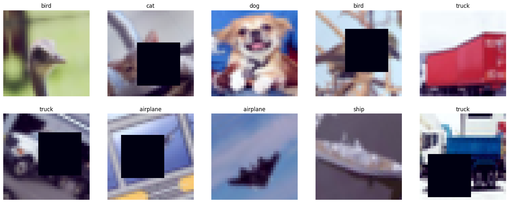
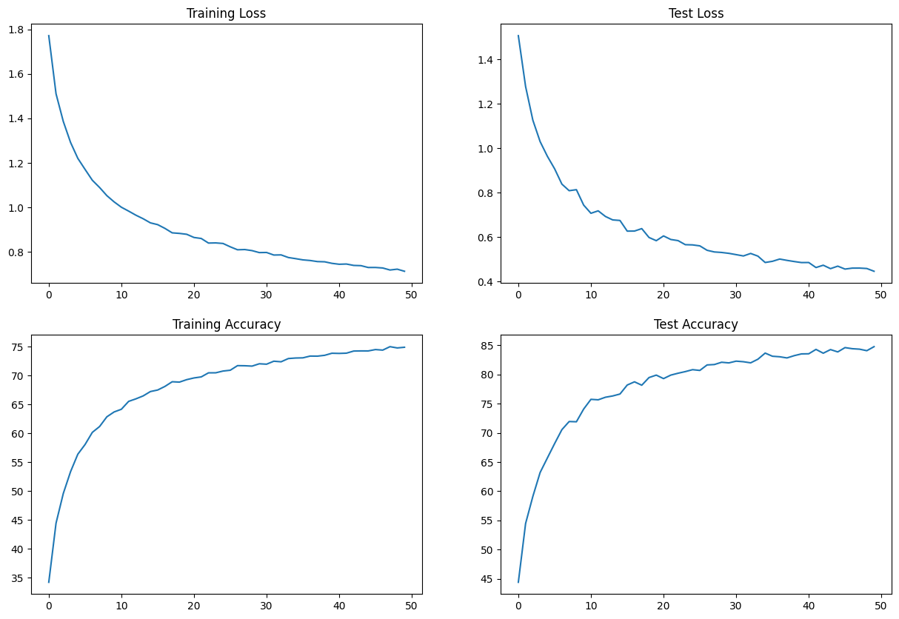
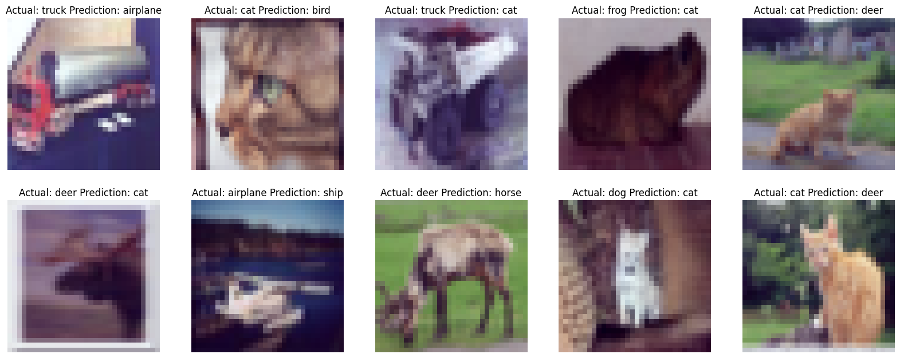

# Assignment
1. has the architecture to C1C2C3C40 (No MaxPooling, but 3 convolutions, where the last one has a stride of 2 instead) (If you can figure out how to use Dilated kernels here instead of MP or strided convolution, then 200pts extra!)
2. total RF must be more than 44
3. one of the layers must use Depthwise Separable Convolution
4. one of the layers must use Dilated Convolution
5. use GAP (compulsory):- add FC after GAP to target #of classes (optional)
6. use albumentation library and apply:
    1. horizontal flip
    2. shiftScaleRotate
    3. coarseDropout (max_holes = 1, max_height=16px, max_width=16, min_holes = 1, min_height=16px, min_width=16px, fill_value=(mean of your dataset), mask_fill_value = None)
7. achieve 85% accuracy, as many epochs as you want. Total Params to be less than 200k.
8. make sure you're following code-modularity (else 0 for full assignment) 
9. upload to Github
10. Attempt S9-Assignment Solution.
11. Questions in the Assignment QnA are:
    1. copy and paste your model code from your model.py file (full code) [125]
    2. copy paste output of torch summary [125]
    3. copy-paste the code where you implemented albumentation transformation for all three transformations [125]
    4. copy paste your training log (you must be running validation/text after each Epoch [125]
    5. Share the link for your README.md file. [200]

# Introduction
The goal of this assignment is to create a model with 4 convolution blocks and use dilation and depth wise seperable convolution. 

# Output of image augmentation

# Model summary
    ----------------------------------------------------------------
            Layer (type)               Output Shape         Param #
    ================================================================
             Conv2d-1           [-1, 16, 32, 32]             432
               ReLU-2           [-1, 16, 32, 32]               0
        BatchNorm2d-3           [-1, 16, 32, 32]              32
            Dropout-4           [-1, 16, 32, 32]               0
             Conv2d-5           [-1, 16, 32, 32]           2,304
               ReLU-6           [-1, 16, 32, 32]               0
        BatchNorm2d-7           [-1, 16, 32, 32]              32
            Dropout-8           [-1, 16, 32, 32]               0
             Conv2d-9           [-1, 16, 30, 30]           2,304
              ReLU-10           [-1, 16, 30, 30]               0
       BatchNorm2d-11           [-1, 16, 30, 30]              32
           Dropout-12           [-1, 16, 30, 30]               0
            Conv2d-13           [-1, 32, 30, 30]           4,608
              ReLU-14           [-1, 32, 30, 30]               0
       BatchNorm2d-15           [-1, 32, 30, 30]              64
           Dropout-16           [-1, 32, 30, 30]               0
            Conv2d-17           [-1, 32, 30, 30]           9,216
              ReLU-18           [-1, 32, 30, 30]               0
       BatchNorm2d-19           [-1, 32, 30, 30]              64
           Dropout-20           [-1, 32, 30, 30]               0
            Conv2d-21           [-1, 32, 15, 15]           9,216
              ReLU-22           [-1, 32, 15, 15]               0
       BatchNorm2d-23           [-1, 32, 15, 15]              64
           Dropout-24           [-1, 32, 15, 15]               0
            Conv2d-25           [-1, 32, 15, 15]             288
            Conv2d-26           [-1, 48, 15, 15]           1,536
              ReLU-27           [-1, 48, 15, 15]               0
       BatchNorm2d-28           [-1, 48, 15, 15]              96
           Dropout-29           [-1, 48, 15, 15]               0
            Conv2d-30           [-1, 48, 15, 15]          20,736
              ReLU-31           [-1, 48, 15, 15]               0
       BatchNorm2d-32           [-1, 48, 15, 15]              96
           Dropout-33           [-1, 48, 15, 15]               0
            Conv2d-34             [-1, 48, 8, 8]          20,736
              ReLU-35             [-1, 48, 8, 8]               0
       BatchNorm2d-36             [-1, 48, 8, 8]              96
           Dropout-37             [-1, 48, 8, 8]               0
            Conv2d-38             [-1, 64, 8, 8]          27,648
              ReLU-39             [-1, 64, 8, 8]               0
       BatchNorm2d-40             [-1, 64, 8, 8]             128
           Dropout-41             [-1, 64, 8, 8]               0
            Conv2d-42             [-1, 64, 8, 8]          36,864
              ReLU-43             [-1, 64, 8, 8]               0
       BatchNorm2d-44             [-1, 64, 8, 8]             128
           Dropout-45             [-1, 64, 8, 8]               0
            Conv2d-46             [-1, 64, 8, 8]          36,864
              ReLU-47             [-1, 64, 8, 8]               0
       BatchNorm2d-48             [-1, 64, 8, 8]             128
           Dropout-49             [-1, 64, 8, 8]               0
         AvgPool2d-50             [-1, 64, 1, 1]               0
            Conv2d-51             [-1, 10, 1, 1]             640
    ================================================================
    Total params: 174,352
    Trainable params: 174,352
    Non-trainable params: 0
    ----------------------------------------------------------------
    Input size (MB): 0.01
    Forward/backward pass size (MB): 4.60
    Params size (MB): 0.67
    Estimated Total Size (MB): 5.28
    ----------------------------------------------------------------

# Training log
    Epoch 1
    Train: Loss=1.6548 Batch_id=390 Accuracy=34.22: 100%|██████████| 391/391 [00:20<00:00, 19.04it/s]
    Test set: Average loss: 1.5073, Accuracy: 4442/10000 (44.42%)

    Epoch 2
    Train: Loss=1.5091 Batch_id=390 Accuracy=44.45: 100%|██████████| 391/391 [00:17<00:00, 22.42it/s]
    Test set: Average loss: 1.2784, Accuracy: 5448/10000 (54.48%)

    Epoch 3
    Train: Loss=1.4269 Batch_id=390 Accuracy=49.59: 100%|██████████| 391/391 [00:17<00:00, 22.91it/s]
    Test set: Average loss: 1.1268, Accuracy: 5912/10000 (59.12%)

    Epoch 4
    Train: Loss=1.0367 Batch_id=390 Accuracy=53.37: 100%|██████████| 391/391 [00:17<00:00, 22.32it/s]
    Test set: Average loss: 1.0305, Accuracy: 6321/10000 (63.21%)

    Epoch 5
    Train: Loss=1.1120 Batch_id=390 Accuracy=56.39: 100%|██████████| 391/391 [00:17<00:00, 22.81it/s]
    Test set: Average loss: 0.9644, Accuracy: 6570/10000 (65.70%)

    Epoch 6
    Train: Loss=1.1826 Batch_id=390 Accuracy=58.07: 100%|██████████| 391/391 [00:17<00:00, 21.92it/s]
    Test set: Average loss: 0.9079, Accuracy: 6817/10000 (68.17%)

    Epoch 7
    Train: Loss=1.1674 Batch_id=390 Accuracy=60.17: 100%|██████████| 391/391 [00:17<00:00, 22.98it/s]
    Test set: Average loss: 0.8390, Accuracy: 7055/10000 (70.55%)

    Epoch 8
    Train: Loss=0.9945 Batch_id=390 Accuracy=61.18: 100%|██████████| 391/391 [00:17<00:00, 21.80it/s]
    Test set: Average loss: 0.8094, Accuracy: 7194/10000 (71.94%)

    Epoch 9
    Train: Loss=1.0792 Batch_id=390 Accuracy=62.86: 100%|██████████| 391/391 [00:16<00:00, 23.19it/s]
    Test set: Average loss: 0.8140, Accuracy: 7190/10000 (71.90%)

    Epoch 10
    Train: Loss=0.9573 Batch_id=390 Accuracy=63.71: 100%|██████████| 391/391 [00:18<00:00, 21.10it/s]
    Test set: Average loss: 0.7445, Accuracy: 7408/10000 (74.08%)

    Epoch 11
    Train: Loss=1.2978 Batch_id=390 Accuracy=64.17: 100%|██████████| 391/391 [00:16<00:00, 23.20it/s]
    Test set: Average loss: 0.7077, Accuracy: 7574/10000 (75.74%)

    Epoch 12
    Train: Loss=1.0853 Batch_id=390 Accuracy=65.54: 100%|██████████| 391/391 [00:17<00:00, 21.83it/s]
    Test set: Average loss: 0.7187, Accuracy: 7566/10000 (75.66%)

    Epoch 13
    Train: Loss=0.9335 Batch_id=390 Accuracy=65.97: 100%|██████████| 391/391 [00:16<00:00, 23.08it/s]
    Test set: Average loss: 0.6934, Accuracy: 7610/10000 (76.10%)

    Epoch 14
    Train: Loss=1.0455 Batch_id=390 Accuracy=66.48: 100%|██████████| 391/391 [00:17<00:00, 22.12it/s]
    Test set: Average loss: 0.6779, Accuracy: 7632/10000 (76.32%)

    Epoch 15
    Train: Loss=1.0111 Batch_id=390 Accuracy=67.24: 100%|██████████| 391/391 [00:16<00:00, 23.09it/s]
    Test set: Average loss: 0.6754, Accuracy: 7665/10000 (76.65%)

    Epoch 16
    Train: Loss=0.9188 Batch_id=390 Accuracy=67.50: 100%|██████████| 391/391 [00:18<00:00, 21.44it/s]
    Test set: Average loss: 0.6274, Accuracy: 7819/10000 (78.19%)

    Epoch 17
    Train: Loss=1.0016 Batch_id=390 Accuracy=68.13: 100%|██████████| 391/391 [00:16<00:00, 23.06it/s]
    Test set: Average loss: 0.6277, Accuracy: 7874/10000 (78.74%)

    Epoch 18
    Train: Loss=0.9930 Batch_id=390 Accuracy=68.93: 100%|██████████| 391/391 [00:17<00:00, 22.63it/s]
    Test set: Average loss: 0.6387, Accuracy: 7816/10000 (78.16%)

    Epoch 19
    Train: Loss=0.9653 Batch_id=390 Accuracy=68.87: 100%|██████████| 391/391 [00:17<00:00, 22.73it/s]
    Test set: Average loss: 0.5988, Accuracy: 7947/10000 (79.47%)

    Epoch 20
    Train: Loss=1.0073 Batch_id=390 Accuracy=69.30: 100%|██████████| 391/391 [00:17<00:00, 22.33it/s]
    Test set: Average loss: 0.5844, Accuracy: 7989/10000 (79.89%)

    Epoch 21
    Train: Loss=0.9455 Batch_id=390 Accuracy=69.59: 100%|██████████| 391/391 [00:17<00:00, 22.81it/s]
    Test set: Average loss: 0.6058, Accuracy: 7929/10000 (79.29%)

    Epoch 22
    Train: Loss=0.9990 Batch_id=390 Accuracy=69.77: 100%|██████████| 391/391 [00:18<00:00, 20.94it/s]
    Test set: Average loss: 0.5898, Accuracy: 7989/10000 (79.89%)

    Epoch 23
    Train: Loss=0.8508 Batch_id=390 Accuracy=70.48: 100%|██████████| 391/391 [00:17<00:00, 22.70it/s]
    Test set: Average loss: 0.5847, Accuracy: 8021/10000 (80.21%)

    Epoch 24
    Train: Loss=0.7072 Batch_id=390 Accuracy=70.48: 100%|██████████| 391/391 [00:17<00:00, 22.09it/s]
    Test set: Average loss: 0.5664, Accuracy: 8049/10000 (80.49%)

    Epoch 25
    Train: Loss=0.8301 Batch_id=390 Accuracy=70.79: 100%|██████████| 391/391 [00:17<00:00, 22.42it/s]
    Test set: Average loss: 0.5654, Accuracy: 8082/10000 (80.82%)

    Epoch 26
    Train: Loss=0.6301 Batch_id=390 Accuracy=70.93: 100%|██████████| 391/391 [00:17<00:00, 22.17it/s]
    Test set: Average loss: 0.5611, Accuracy: 8069/10000 (80.69%)

    Epoch 27
    Train: Loss=0.7438 Batch_id=390 Accuracy=71.72: 100%|██████████| 391/391 [00:17<00:00, 22.41it/s]
    Test set: Average loss: 0.5411, Accuracy: 8163/10000 (81.63%)

    Epoch 28
    Train: Loss=1.0077 Batch_id=390 Accuracy=71.70: 100%|██████████| 391/391 [00:18<00:00, 21.21it/s]
    Test set: Average loss: 0.5336, Accuracy: 8170/10000 (81.70%)

    Epoch 29
    Train: Loss=0.8513 Batch_id=390 Accuracy=71.64: 100%|██████████| 391/391 [00:17<00:00, 22.44it/s]
    Test set: Average loss: 0.5314, Accuracy: 8209/10000 (82.09%)

    Epoch 30
    Train: Loss=0.8292 Batch_id=390 Accuracy=72.05: 100%|██████████| 391/391 [00:17<00:00, 22.54it/s]
    Test set: Average loss: 0.5274, Accuracy: 8198/10000 (81.98%)

    Epoch 31
    Train: Loss=0.8463 Batch_id=390 Accuracy=71.97: 100%|██████████| 391/391 [00:17<00:00, 22.91it/s]
    Test set: Average loss: 0.5216, Accuracy: 8228/10000 (82.28%)

    Epoch 32
    Train: Loss=0.7464 Batch_id=390 Accuracy=72.49: 100%|██████████| 391/391 [00:17<00:00, 22.05it/s]
    Test set: Average loss: 0.5156, Accuracy: 8218/10000 (82.18%)

    Epoch 33
    Train: Loss=0.9696 Batch_id=390 Accuracy=72.39: 100%|██████████| 391/391 [00:17<00:00, 22.40it/s]
    Test set: Average loss: 0.5269, Accuracy: 8199/10000 (81.99%)

    Epoch 34
    Train: Loss=0.7304 Batch_id=390 Accuracy=72.95: 100%|██████████| 391/391 [00:19<00:00, 20.43it/s]
    Test set: Average loss: 0.5149, Accuracy: 8261/10000 (82.61%)

    Epoch 35
    Train: Loss=0.8937 Batch_id=390 Accuracy=73.04: 100%|██████████| 391/391 [00:17<00:00, 22.38it/s]
    Test set: Average loss: 0.4862, Accuracy: 8366/10000 (83.66%)

    Epoch 36
    Train: Loss=0.7677 Batch_id=390 Accuracy=73.07: 100%|██████████| 391/391 [00:18<00:00, 21.43it/s]
    Test set: Average loss: 0.4915, Accuracy: 8312/10000 (83.12%)

    Epoch 37
    Train: Loss=0.6255 Batch_id=390 Accuracy=73.38: 100%|██████████| 391/391 [00:17<00:00, 22.93it/s]
    Test set: Average loss: 0.5017, Accuracy: 8303/10000 (83.03%)

    Epoch 38
    Train: Loss=0.7575 Batch_id=390 Accuracy=73.37: 100%|██████████| 391/391 [00:18<00:00, 21.63it/s]
    Test set: Average loss: 0.4958, Accuracy: 8283/10000 (82.83%)

    Epoch 39
    Train: Loss=0.6788 Batch_id=390 Accuracy=73.51: 100%|██████████| 391/391 [00:17<00:00, 22.47it/s]
    Test set: Average loss: 0.4905, Accuracy: 8322/10000 (83.22%)

    Epoch 40
    Train: Loss=0.7440 Batch_id=390 Accuracy=73.87: 100%|██████████| 391/391 [00:18<00:00, 21.53it/s]
    Test set: Average loss: 0.4859, Accuracy: 8352/10000 (83.52%)

    Epoch 41
    Train: Loss=0.8027 Batch_id=390 Accuracy=73.84: 100%|██████████| 391/391 [00:17<00:00, 22.33it/s]
    Test set: Average loss: 0.4861, Accuracy: 8354/10000 (83.54%)

    Epoch 42
    Train: Loss=0.8620 Batch_id=390 Accuracy=73.88: 100%|██████████| 391/391 [00:18<00:00, 21.35it/s]
    Test set: Average loss: 0.4635, Accuracy: 8429/10000 (84.29%)

    Epoch 43
    Train: Loss=0.8501 Batch_id=390 Accuracy=74.25: 100%|██████████| 391/391 [00:17<00:00, 22.66it/s]
    Test set: Average loss: 0.4739, Accuracy: 8364/10000 (83.64%)

    Epoch 44
    Train: Loss=0.7002 Batch_id=390 Accuracy=74.27: 100%|██████████| 391/391 [00:18<00:00, 21.34it/s]
    Test set: Average loss: 0.4585, Accuracy: 8426/10000 (84.26%)

    Epoch 45
    Train: Loss=0.9156 Batch_id=390 Accuracy=74.27: 100%|██████████| 391/391 [00:18<00:00, 21.13it/s]
    Test set: Average loss: 0.4697, Accuracy: 8386/10000 (83.86%)

    Epoch 46
    Train: Loss=0.6463 Batch_id=390 Accuracy=74.51: 100%|██████████| 391/391 [00:18<00:00, 21.36it/s]
    Test set: Average loss: 0.4565, Accuracy: 8460/10000 (84.60%)

    Epoch 47
    Train: Loss=0.6693 Batch_id=390 Accuracy=74.41: 100%|██████████| 391/391 [00:17<00:00, 22.65it/s]
    Test set: Average loss: 0.4608, Accuracy: 8441/10000 (84.41%)

    Epoch 48
    Train: Loss=0.6569 Batch_id=390 Accuracy=75.01: 100%|██████████| 391/391 [00:18<00:00, 21.19it/s]
    Test set: Average loss: 0.4610, Accuracy: 8433/10000 (84.33%)

    Epoch 49
    Train: Loss=0.6658 Batch_id=390 Accuracy=74.79: 100%|██████████| 391/391 [00:17<00:00, 21.83it/s]
    Test set: Average loss: 0.4591, Accuracy: 8407/10000 (84.07%)

    Epoch 50
    Train: Loss=0.5489 Batch_id=390 Accuracy=74.91: 100%|██████████| 391/391 [00:19<00:00, 20.07it/s]
    Test set: Average loss: 0.4467, Accuracy: 8476/10000 (84.76%)

# Performance Graphs

# Misclassified Images
