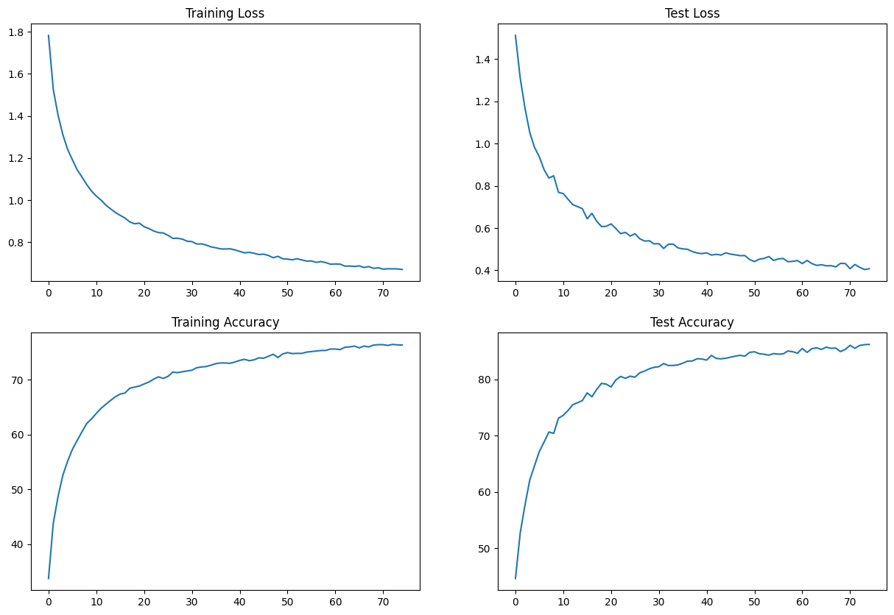

# Assignment
1. has the architecture to C1C2C3C40 (No MaxPooling, but 3 convolutions, where the last one has a stride of 2 instead) (If you can figure out how to use Dilated kernels here instead of MP or strided convolution, then 200pts extra!)
2. total RF must be more than 44
3. one of the layers must use Depthwise Separable Convolution
4. one of the layers must use Dilated Convolution
5. use GAP (compulsory):- add FC after GAP to target #of classes (optional)
6. use albumentation library and apply:
    1. horizontal flip
    2. shiftScaleRotate
    3. coarseDropout (max_holes = 1, max_height=16px, max_width=16, min_holes = 1, min_height=16px, min_width=16px, fill_value=(mean of your dataset), mask_fill_value = None)
7. achieve 85% accuracy, as many epochs as you want. Total Params to be less than 200k.
8. make sure you're following code-modularity (else 0 for full assignment) 
9. upload to Github
10. Attempt S9-Assignment Solution.
11. Questions in the Assignment QnA are:
    1. copy and paste your model code from your model.py file (full code) [125]
    2. copy paste output of torch summary [125]
    3. copy-paste the code where you implemented albumentation transformation for all three transformations [125]
    4. copy paste your training log (you must be running validation/text after each Epoch [125]
    5. Share the link for your README.md file. [200]

# Introduction
The goal of this assignment is to create a model with 4 convolution blocks and use dilation and depth wise seperable convolution. 

## Output of image augmentation

## Model summary
    ----------------------------------------------------------------
            Layer (type)               Output Shape         Param #
    ================================================================
             Conv2d-1           [-1, 16, 32, 32]             432
               ReLU-2           [-1, 16, 32, 32]               0
        BatchNorm2d-3           [-1, 16, 32, 32]              32
            Dropout-4           [-1, 16, 32, 32]               0
             Conv2d-5           [-1, 16, 32, 32]           2,304
               ReLU-6           [-1, 16, 32, 32]               0
        BatchNorm2d-7           [-1, 16, 32, 32]              32
            Dropout-8           [-1, 16, 32, 32]               0
             Conv2d-9           [-1, 16, 30, 30]           2,304
              ReLU-10           [-1, 16, 30, 30]               0
       BatchNorm2d-11           [-1, 16, 30, 30]              32
           Dropout-12           [-1, 16, 30, 30]               0
            Conv2d-13           [-1, 32, 30, 30]           4,608
              ReLU-14           [-1, 32, 30, 30]               0
       BatchNorm2d-15           [-1, 32, 30, 30]              64
           Dropout-16           [-1, 32, 30, 30]               0
            Conv2d-17           [-1, 32, 30, 30]           9,216
              ReLU-18           [-1, 32, 30, 30]               0
       BatchNorm2d-19           [-1, 32, 30, 30]              64
           Dropout-20           [-1, 32, 30, 30]               0
            Conv2d-21           [-1, 32, 15, 15]           9,216
              ReLU-22           [-1, 32, 15, 15]               0
       BatchNorm2d-23           [-1, 32, 15, 15]              64
           Dropout-24           [-1, 32, 15, 15]               0
            Conv2d-25           [-1, 32, 15, 15]             288
            Conv2d-26           [-1, 48, 15, 15]           1,536
              ReLU-27           [-1, 48, 15, 15]               0
       BatchNorm2d-28           [-1, 48, 15, 15]              96
           Dropout-29           [-1, 48, 15, 15]               0
            Conv2d-30           [-1, 48, 15, 15]          20,736
              ReLU-31           [-1, 48, 15, 15]               0
       BatchNorm2d-32           [-1, 48, 15, 15]              96
           Dropout-33           [-1, 48, 15, 15]               0
            Conv2d-34             [-1, 48, 8, 8]          20,736
              ReLU-35             [-1, 48, 8, 8]               0
       BatchNorm2d-36             [-1, 48, 8, 8]              96
           Dropout-37             [-1, 48, 8, 8]               0
            Conv2d-38             [-1, 64, 8, 8]          27,648
              ReLU-39             [-1, 64, 8, 8]               0
       BatchNorm2d-40             [-1, 64, 8, 8]             128
           Dropout-41             [-1, 64, 8, 8]               0
            Conv2d-42             [-1, 64, 8, 8]          36,864
              ReLU-43             [-1, 64, 8, 8]               0
       BatchNorm2d-44             [-1, 64, 8, 8]             128
           Dropout-45             [-1, 64, 8, 8]               0
            Conv2d-46             [-1, 64, 8, 8]          36,864
              ReLU-47             [-1, 64, 8, 8]               0
       BatchNorm2d-48             [-1, 64, 8, 8]             128
           Dropout-49             [-1, 64, 8, 8]               0
         AvgPool2d-50             [-1, 64, 1, 1]               0
            Conv2d-51             [-1, 10, 1, 1]             640
    ================================================================
    Total params: 174,352
    Trainable params: 174,352
    Non-trainable params: 0
    ----------------------------------------------------------------
    Input size (MB): 0.01
    Forward/backward pass size (MB): 4.60
    Params size (MB): 0.67
    Estimated Total Size (MB): 5.28
    ----------------------------------------------------------------

## Receptive field calculation
|layer|r_in|n_in|j_in|s|r_out|n_out|j_out|
|-----|----|----|----|-|-----|-----|-----|
|conv_1|1|32|1|1|3|32|1|
|conv_2|3|32|1|1|5|32|1|
|conv_3_dilation|5|32|1|1|9|30|1|
|conv_4|9|30|1|1|11|30|1|
|conv_5|11|30|1|1|13|30|1|
|conv_6_stride|13|30|1|2|15|15|2|
|conv_7|15|15|2|1|19|15|2|
|conv_8|19|15|2|1|23|15|2|
|conv_9_stride|23|15|2|1|27|15|4|
|conv_10|27|8|4|1|35|8|4|
|conv_11|35|8|4|1|48|8|4|
|conv_12|48|8|4|1|51|8|4|

## Training log
    Epoch 1
    Train: Loss=1.7162 Batch_id=390 Accuracy=33.76: 100%|██████████| 391/391 [00:22<00:00, 17.47it/s]
    Test set: Average loss: 1.5116, Accuracy: 4462/10000 (44.62%)

    Epoch 2
    Train: Loss=1.4815 Batch_id=390 Accuracy=43.85: 100%|██████████| 391/391 [00:17<00:00, 22.03it/s]
    Test set: Average loss: 1.3093, Accuracy: 5273/10000 (52.73%)

    Epoch 3
    Train: Loss=1.3626 Batch_id=390 Accuracy=48.72: 100%|██████████| 391/391 [00:18<00:00, 20.80it/s]
    Test set: Average loss: 1.1662, Accuracy: 5772/10000 (57.72%)

    Epoch 4
    Train: Loss=1.0554 Batch_id=390 Accuracy=52.60: 100%|██████████| 391/391 [00:17<00:00, 22.30it/s]
    Test set: Average loss: 1.0514, Accuracy: 6215/10000 (62.15%)

    Epoch 5
    Train: Loss=1.1430 Batch_id=390 Accuracy=55.16: 100%|██████████| 391/391 [00:18<00:00, 20.96it/s]
    Test set: Average loss: 0.9812, Accuracy: 6470/10000 (64.70%)

    Epoch 6
    Train: Loss=1.2122 Batch_id=390 Accuracy=57.32: 100%|██████████| 391/391 [00:17<00:00, 22.40it/s]
    Test set: Average loss: 0.9366, Accuracy: 6722/10000 (67.22%)

    Epoch 7
    Train: Loss=1.2412 Batch_id=390 Accuracy=58.96: 100%|██████████| 391/391 [00:18<00:00, 21.64it/s]
    Test set: Average loss: 0.8757, Accuracy: 6890/10000 (68.90%)

    Epoch 8
    Train: Loss=1.0137 Batch_id=390 Accuracy=60.53: 100%|██████████| 391/391 [00:18<00:00, 20.70it/s]
    Test set: Average loss: 0.8366, Accuracy: 7067/10000 (70.67%)

    Epoch 9
    Train: Loss=0.9566 Batch_id=390 Accuracy=62.04: 100%|██████████| 391/391 [00:17<00:00, 22.14it/s]
    Test set: Average loss: 0.8472, Accuracy: 7042/10000 (70.42%)

    Epoch 10
    Train: Loss=1.0954 Batch_id=390 Accuracy=62.88: 100%|██████████| 391/391 [00:18<00:00, 21.51it/s]
    Test set: Average loss: 0.7690, Accuracy: 7313/10000 (73.13%)

    Epoch 11
    Train: Loss=1.2396 Batch_id=390 Accuracy=63.89: 100%|██████████| 391/391 [00:17<00:00, 22.06it/s]
    Test set: Average loss: 0.7630, Accuracy: 7363/10000 (73.63%)

    Epoch 12
    Train: Loss=1.0567 Batch_id=390 Accuracy=64.82: 100%|██████████| 391/391 [00:18<00:00, 21.10it/s]
    Test set: Average loss: 0.7361, Accuracy: 7449/10000 (74.49%)

    Epoch 13
    Train: Loss=0.8463 Batch_id=390 Accuracy=65.55: 100%|██████████| 391/391 [00:17<00:00, 21.86it/s]
    Test set: Average loss: 0.7106, Accuracy: 7552/10000 (75.52%)

    Epoch 14
    Train: Loss=1.1188 Batch_id=390 Accuracy=66.27: 100%|██████████| 391/391 [00:18<00:00, 21.18it/s]
    Test set: Average loss: 0.7014, Accuracy: 7588/10000 (75.88%)

    Epoch 15
    Train: Loss=1.0696 Batch_id=390 Accuracy=66.92: 100%|██████████| 391/391 [00:17<00:00, 22.14it/s]
    Test set: Average loss: 0.6915, Accuracy: 7626/10000 (76.26%)

    Epoch 16
    Train: Loss=0.8590 Batch_id=390 Accuracy=67.41: 100%|██████████| 391/391 [00:19<00:00, 20.42it/s]
    Test set: Average loss: 0.6438, Accuracy: 7762/10000 (77.62%)

    Epoch 17
    Train: Loss=0.9428 Batch_id=390 Accuracy=67.60: 100%|██████████| 391/391 [00:17<00:00, 22.05it/s]
    Test set: Average loss: 0.6696, Accuracy: 7693/10000 (76.93%)

    Epoch 18
    Train: Loss=0.9588 Batch_id=390 Accuracy=68.47: 100%|██████████| 391/391 [00:18<00:00, 21.04it/s]
    Test set: Average loss: 0.6319, Accuracy: 7824/10000 (78.24%)

    Epoch 19
    Train: Loss=0.9859 Batch_id=390 Accuracy=68.68: 100%|██████████| 391/391 [00:19<00:00, 20.52it/s]
    Test set: Average loss: 0.6070, Accuracy: 7931/10000 (79.31%)

    Epoch 20
    Train: Loss=0.9983 Batch_id=390 Accuracy=68.88: 100%|██████████| 391/391 [00:18<00:00, 20.88it/s]
    Test set: Average loss: 0.6081, Accuracy: 7918/10000 (79.18%)

    Epoch 21
    Train: Loss=0.9462 Batch_id=390 Accuracy=69.25: 100%|██████████| 391/391 [00:17<00:00, 22.58it/s]
    Test set: Average loss: 0.6196, Accuracy: 7867/10000 (78.67%)

    Epoch 22
    Train: Loss=1.0427 Batch_id=390 Accuracy=69.61: 100%|██████████| 391/391 [00:18<00:00, 21.18it/s]
    Test set: Average loss: 0.5978, Accuracy: 7992/10000 (79.92%)

    Epoch 23
    Train: Loss=0.9019 Batch_id=390 Accuracy=70.13: 100%|██████████| 391/391 [00:17<00:00, 22.66it/s]
    Test set: Average loss: 0.5733, Accuracy: 8055/10000 (80.55%)

    Epoch 24
    Train: Loss=0.6569 Batch_id=390 Accuracy=70.56: 100%|██████████| 391/391 [00:18<00:00, 20.71it/s]
    Test set: Average loss: 0.5794, Accuracy: 8021/10000 (80.21%)

    Epoch 25
    Train: Loss=0.8825 Batch_id=390 Accuracy=70.26: 100%|██████████| 391/391 [00:17<00:00, 22.54it/s]
    Test set: Average loss: 0.5620, Accuracy: 8059/10000 (80.59%)

    Epoch 26
    Train: Loss=0.6786 Batch_id=390 Accuracy=70.64: 100%|██████████| 391/391 [00:18<00:00, 20.99it/s]
    Test set: Average loss: 0.5731, Accuracy: 8042/10000 (80.42%)

    Epoch 27
    Train: Loss=0.9419 Batch_id=390 Accuracy=71.42: 100%|██████████| 391/391 [00:17<00:00, 22.42it/s]
    Test set: Average loss: 0.5493, Accuracy: 8119/10000 (81.19%)

    Epoch 28
    Train: Loss=1.1358 Batch_id=390 Accuracy=71.32: 100%|██████████| 391/391 [00:18<00:00, 20.74it/s]
    Test set: Average loss: 0.5383, Accuracy: 8150/10000 (81.50%)

    Epoch 29
    Train: Loss=0.8445 Batch_id=390 Accuracy=71.48: 100%|██████████| 391/391 [00:17<00:00, 22.39it/s]
    Test set: Average loss: 0.5397, Accuracy: 8190/10000 (81.90%)

    Epoch 30
    Train: Loss=0.8401 Batch_id=390 Accuracy=71.63: 100%|██████████| 391/391 [00:19<00:00, 19.99it/s]
    Test set: Average loss: 0.5250, Accuracy: 8217/10000 (82.17%)

    Epoch 31
    Train: Loss=0.8546 Batch_id=390 Accuracy=71.76: 100%|██████████| 391/391 [00:17<00:00, 22.41it/s]
    Test set: Average loss: 0.5259, Accuracy: 8228/10000 (82.28%)

    Epoch 32
    Train: Loss=0.7799 Batch_id=390 Accuracy=72.22: 100%|██████████| 391/391 [00:18<00:00, 21.38it/s]
    Test set: Average loss: 0.5031, Accuracy: 8284/10000 (82.84%)

    Epoch 33
    Train: Loss=0.8186 Batch_id=390 Accuracy=72.36: 100%|██████████| 391/391 [00:17<00:00, 22.28it/s]
    Test set: Average loss: 0.5235, Accuracy: 8250/10000 (82.50%)

    Epoch 34
    Train: Loss=0.7783 Batch_id=390 Accuracy=72.44: 100%|██████████| 391/391 [00:18<00:00, 21.66it/s]
    Test set: Average loss: 0.5241, Accuracy: 8250/10000 (82.50%)

    Epoch 35
    Train: Loss=0.9532 Batch_id=390 Accuracy=72.69: 100%|██████████| 391/391 [00:18<00:00, 21.37it/s]
    Test set: Average loss: 0.5059, Accuracy: 8260/10000 (82.60%)

    Epoch 36
    Train: Loss=0.7455 Batch_id=390 Accuracy=72.96: 100%|██████████| 391/391 [00:17<00:00, 22.53it/s]
    Test set: Average loss: 0.5013, Accuracy: 8290/10000 (82.90%)

    Epoch 37
    Train: Loss=0.5715 Batch_id=390 Accuracy=73.09: 100%|██████████| 391/391 [00:17<00:00, 22.28it/s]
    Test set: Average loss: 0.4993, Accuracy: 8327/10000 (83.27%)

    Epoch 38
    Train: Loss=0.6999 Batch_id=390 Accuracy=73.08: 100%|██████████| 391/391 [00:17<00:00, 22.44it/s]
    Test set: Average loss: 0.4885, Accuracy: 8329/10000 (83.29%)

    Epoch 39
    Train: Loss=0.7130 Batch_id=390 Accuracy=73.03: 100%|██████████| 391/391 [00:17<00:00, 22.52it/s]
    Test set: Average loss: 0.4818, Accuracy: 8370/10000 (83.70%)

    Epoch 40
    Train: Loss=0.8696 Batch_id=390 Accuracy=73.26: 100%|██████████| 391/391 [00:17<00:00, 22.42it/s]
    Test set: Average loss: 0.4788, Accuracy: 8365/10000 (83.65%)

    Epoch 41
    Train: Loss=0.8408 Batch_id=390 Accuracy=73.55: 100%|██████████| 391/391 [00:18<00:00, 21.14it/s]
    Test set: Average loss: 0.4825, Accuracy: 8345/10000 (83.45%)

    Epoch 42
    Train: Loss=0.8698 Batch_id=390 Accuracy=73.75: 100%|██████████| 391/391 [00:17<00:00, 22.24it/s]
    Test set: Average loss: 0.4719, Accuracy: 8429/10000 (84.29%)

    Epoch 43
    Train: Loss=0.8176 Batch_id=390 Accuracy=73.49: 100%|██████████| 391/391 [00:17<00:00, 22.72it/s]
    Test set: Average loss: 0.4756, Accuracy: 8375/10000 (83.75%)

    Epoch 44
    Train: Loss=0.8419 Batch_id=390 Accuracy=73.66: 100%|██████████| 391/391 [00:17<00:00, 22.62it/s]
    Test set: Average loss: 0.4721, Accuracy: 8368/10000 (83.68%)

    Epoch 45
    Train: Loss=0.8815 Batch_id=390 Accuracy=74.02: 100%|██████████| 391/391 [00:17<00:00, 22.58it/s]
    Test set: Average loss: 0.4826, Accuracy: 8378/10000 (83.78%)

    Epoch 46
    Train: Loss=0.7588 Batch_id=390 Accuracy=73.96: 100%|██████████| 391/391 [00:18<00:00, 21.09it/s]
    Test set: Average loss: 0.4764, Accuracy: 8397/10000 (83.97%)

    Epoch 47
    Train: Loss=0.7131 Batch_id=390 Accuracy=74.31: 100%|██████████| 391/391 [00:17<00:00, 21.73it/s]
    Test set: Average loss: 0.4730, Accuracy: 8416/10000 (84.16%)

    Epoch 48
    Train: Loss=0.7509 Batch_id=390 Accuracy=74.67: 100%|██████████| 391/391 [00:17<00:00, 22.30it/s]
    Test set: Average loss: 0.4691, Accuracy: 8430/10000 (84.30%)

    Epoch 49
    Train: Loss=0.7786 Batch_id=390 Accuracy=74.07: 100%|██████████| 391/391 [00:18<00:00, 20.89it/s]
    Test set: Average loss: 0.4697, Accuracy: 8415/10000 (84.15%)

    Epoch 50
    Train: Loss=0.6208 Batch_id=390 Accuracy=74.74: 100%|██████████| 391/391 [00:19<00:00, 20.55it/s]
    Test set: Average loss: 0.4506, Accuracy: 8483/10000 (84.83%)

    Epoch 51
    Train: Loss=0.6684 Batch_id=390 Accuracy=74.98: 100%|██████████| 391/391 [00:18<00:00, 20.60it/s]
    Test set: Average loss: 0.4413, Accuracy: 8493/10000 (84.93%)

    Epoch 52
    Train: Loss=0.7188 Batch_id=390 Accuracy=74.80: 100%|██████████| 391/391 [00:18<00:00, 20.72it/s]
    Test set: Average loss: 0.4524, Accuracy: 8459/10000 (84.59%)

    Epoch 53
    Train: Loss=0.7556 Batch_id=390 Accuracy=74.84: 100%|██████████| 391/391 [00:18<00:00, 21.48it/s]
    Test set: Average loss: 0.4560, Accuracy: 8449/10000 (84.49%)

    Epoch 54
    Train: Loss=0.6456 Batch_id=390 Accuracy=74.83: 100%|██████████| 391/391 [00:17<00:00, 22.40it/s]
    Test set: Average loss: 0.4650, Accuracy: 8433/10000 (84.33%)

    Epoch 55
    Train: Loss=0.7151 Batch_id=390 Accuracy=75.07: 100%|██████████| 391/391 [00:17<00:00, 21.76it/s]
    Test set: Average loss: 0.4463, Accuracy: 8461/10000 (84.61%)

    Epoch 56
    Train: Loss=0.6696 Batch_id=390 Accuracy=75.17: 100%|██████████| 391/391 [00:17<00:00, 22.25it/s]
    Test set: Average loss: 0.4539, Accuracy: 8451/10000 (84.51%)

    Epoch 57
    Train: Loss=0.7080 Batch_id=390 Accuracy=75.26: 100%|██████████| 391/391 [00:19<00:00, 20.58it/s]
    Test set: Average loss: 0.4558, Accuracy: 8456/10000 (84.56%)

    Epoch 58
    Train: Loss=0.6368 Batch_id=390 Accuracy=75.36: 100%|██████████| 391/391 [00:18<00:00, 21.56it/s]
    Test set: Average loss: 0.4405, Accuracy: 8507/10000 (85.07%)

    Epoch 59
    Train: Loss=0.5579 Batch_id=390 Accuracy=75.37: 100%|██████████| 391/391 [00:17<00:00, 22.40it/s]
    Test set: Average loss: 0.4422, Accuracy: 8494/10000 (84.94%)

    Epoch 60
    Train: Loss=0.7456 Batch_id=390 Accuracy=75.64: 100%|██████████| 391/391 [00:17<00:00, 21.97it/s]
    Test set: Average loss: 0.4458, Accuracy: 8468/10000 (84.68%)

    Epoch 61
    Train: Loss=0.7938 Batch_id=390 Accuracy=75.63: 100%|██████████| 391/391 [00:17<00:00, 22.13it/s]
    Test set: Average loss: 0.4316, Accuracy: 8552/10000 (85.52%)

    Epoch 62
    Train: Loss=0.7390 Batch_id=390 Accuracy=75.53: 100%|██████████| 391/391 [00:18<00:00, 20.85it/s]
    Test set: Average loss: 0.4465, Accuracy: 8482/10000 (84.82%)

    Epoch 63
    Train: Loss=0.7041 Batch_id=390 Accuracy=75.95: 100%|██████████| 391/391 [00:17<00:00, 21.79it/s]
    Test set: Average loss: 0.4318, Accuracy: 8547/10000 (85.47%)

    Epoch 64
    Train: Loss=0.8725 Batch_id=390 Accuracy=76.02: 100%|██████████| 391/391 [00:18<00:00, 20.80it/s]
    Test set: Average loss: 0.4231, Accuracy: 8564/10000 (85.64%)

    Epoch 65
    Train: Loss=0.6375 Batch_id=390 Accuracy=76.16: 100%|██████████| 391/391 [00:17<00:00, 21.94it/s]
    Test set: Average loss: 0.4261, Accuracy: 8535/10000 (85.35%)

    Epoch 66
    Train: Loss=0.5413 Batch_id=390 Accuracy=75.85: 100%|██████████| 391/391 [00:18<00:00, 20.76it/s]
    Test set: Average loss: 0.4213, Accuracy: 8575/10000 (85.75%)

    Epoch 67
    Train: Loss=0.5319 Batch_id=390 Accuracy=76.16: 100%|██████████| 391/391 [00:17<00:00, 21.86it/s]
    Test set: Average loss: 0.4217, Accuracy: 8554/10000 (85.54%)

    Epoch 68
    Train: Loss=0.7903 Batch_id=390 Accuracy=76.03: 100%|██████████| 391/391 [00:20<00:00, 19.49it/s]
    Test set: Average loss: 0.4163, Accuracy: 8559/10000 (85.59%)

    Epoch 69
    Train: Loss=0.7147 Batch_id=390 Accuracy=76.34: 100%|██████████| 391/391 [00:17<00:00, 21.94it/s]
    Test set: Average loss: 0.4327, Accuracy: 8497/10000 (84.97%)

    Epoch 70
    Train: Loss=0.6117 Batch_id=390 Accuracy=76.43: 100%|██████████| 391/391 [00:18<00:00, 21.06it/s]
    Test set: Average loss: 0.4319, Accuracy: 8535/10000 (85.35%)

    Epoch 71
    Train: Loss=0.7988 Batch_id=390 Accuracy=76.42: 100%|██████████| 391/391 [00:17<00:00, 22.06it/s]
    Test set: Average loss: 0.4075, Accuracy: 8608/10000 (86.08%)

    Epoch 72
    Train: Loss=0.7026 Batch_id=390 Accuracy=76.29: 100%|██████████| 391/391 [00:19<00:00, 20.55it/s]
    Test set: Average loss: 0.4273, Accuracy: 8556/10000 (85.56%)

    Epoch 73
    Train: Loss=0.7414 Batch_id=390 Accuracy=76.47: 100%|██████████| 391/391 [00:19<00:00, 20.22it/s]
    Test set: Average loss: 0.4140, Accuracy: 8605/10000 (86.05%)

    Epoch 74
    Train: Loss=0.7923 Batch_id=390 Accuracy=76.38: 100%|██████████| 391/391 [00:19<00:00, 20.45it/s]
    Test set: Average loss: 0.4036, Accuracy: 8620/10000 (86.20%)

    Epoch 75
    Train: Loss=0.6698 Batch_id=390 Accuracy=76.37: 100%|██████████| 391/391 [00:17<00:00, 21.82it/s]
    Test set: Average loss: 0.4069, Accuracy: 8624/10000 (86.24%)

## Performance Graphs

## Misclassified Images
